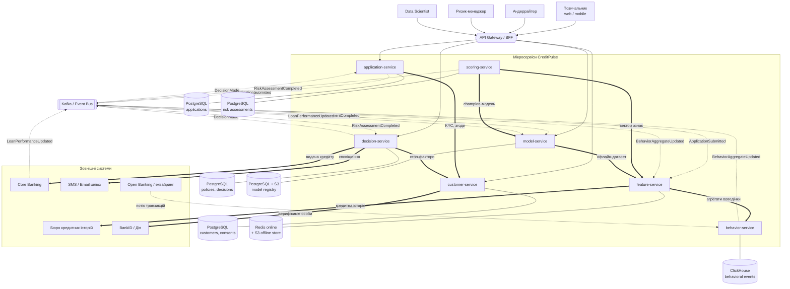

# Лабораторна робота №1

## Аналіз мікросервісної системи та класифікація змін

**Група:** `___________`
**Бригада:** `___________`
**Склад бригади:** `___________`, `___________`, `___________`
**Назва системи:** **CreditPulse** — платформа оцінки кредитного ризику фізичних осіб на основі поведінкових даних та машинного навчання.

---

## 1. Опис предметної області (Завдання 1)

### 1.1. Призначення системи

**CreditPulse** — це система автоматизованого прийняття кредитних рішень для банку або небанківської фінансової установи, що видає кредити фізичним особам (споживчі кредити, кредитні картки, BNPL).

Класичний скоринг спирається на анкету позичальника та дані бюро кредитних історій. Проблема такого підходу — значна частка заявників із «тонким кредитним файлом» (*thin file*): молодь, самозайняті, клієнти без кредитної історії. Для них традиційна модель або відмовляє, або оцінює ризик із великою похибкою.

CreditPulse додає до оцінки **поведінкові дані**:

- **транзакційна поведінка** — структура та регулярність витрат, стабільність надходжень, коефіцієнт варіації доходу, частка зняття готівки, кількість овердрафтів;
- **платіжна дисципліна** — історія погашень за діючими продуктами, глибина та частота прострочень;
- **цифрова поведінка в каналі** — активність у мобільному застосунку, час доби операцій, тип і стабільність пристрою, географія;
- **цифровий слід заповнення заявки** — час заповнення полів, кількість виправлень, використання copy-paste, повернення до попередніх кроків (сильний предиктор шахрайства та навмисного викривлення даних).

На цих ознаках навчається ML-модель, що оцінює **ймовірність дефолту (PD, Probability of Default)** протягом наступних 12 місяців. Модель повертає не лише число, а й **пояснення рішення** (reason codes), що є вимогою регулятора: клієнт має право знати причину відмови, а рішення не може бути «чорною скринькою».

### 1.2. Основні користувачі

| Користувач | Роль у системі |
|---|---|
| **Позичальник (фізична особа)** | Подає заявку через веб- або мобільний застосунок, надає згоди на обробку даних, отримує рішення та пояснення |
| **Кредитний андеррайтер** | Розглядає заявки «сірої зони», може перевизначити (override) автоматичне рішення з обов'язковим обґрунтуванням |
| **Ризик-менеджер** | Налаштовує кредитну політику: порогові значення (cut-off), матрицю лімітів і ставок, стоп-фактори |
| **Data Scientist / ML-інженер** | Навчає, валідує та версіонує моделі, аналізує дрейф і якість |
| **Комплаєнс-офіцер / аудитор** | Перевіряє відтворюваність і пояснюваність рішень, дотримання вимог щодо персональних даних |
| **Зовнішні системи** | Бюро кредитних історій, BankID/Дія, Open Banking, Core Banking, шлюз сповіщень |

### 1.3. Основні функції системи

1. Ідентифікація та верифікація клієнта (KYC), облік згод на обробку даних.
2. Приймання та ведення життєвого циклу кредитної заявки.
3. Збір, нормалізація та агрегація поведінкових подій.
4. Обчислення ознак (feature engineering) і зберігання їх у feature store.
5. Збагачення профілю зовнішніми даними (кредитна історія, Open Banking).
6. Інференс ML-моделі: розрахунок PD, скорбалу та ризик-групи.
7. Генерація пояснення рішення (reason codes на базі SHAP).
8. Застосування кредитної політики: автоматичне схвалення/відмова, розрахунок ліміту та ставки.
9. Маршрутизація межових заявок на ручний андеррайтинг.
10. Версіонування моделей, моніторинг дрейфу даних і деградації якості.
11. Незмінний аудит рішень для регулятора.
12. Сповіщення клієнта про результат.

### 1.4. Головні бізнес-сутності

`Customer` (клієнт), `Consent` (згода), `LoanApplication` (заявка), `BehavioralEvent` (поведінкова подія), `TransactionAggregate` (агрегат поведінки), `FeatureVector` (вектор ознак), `ModelVersion` (версія моделі), `RiskAssessment` (оцінка ризику: PD + скорбал), `Explanation` (пояснення), `PolicyRuleSet` (кредитна політика), `CreditDecision` (кредитне рішення), `DecisionAuditRecord` (аудит-запис).

### 1.5. Типовий сценарій роботи користувача

1. Клієнт автентифікується через BankID/Дія та подає заявку: 50 000 грн на 12 місяців.
2. Система перевіряє статус KYC та наявність чинної згоди на обробку поведінкових даних.
3. Заявка переходить у статус `SCORING`, публікується подія `ApplicationSubmitted`.
4. Система збирає вектор ознак: поведінкові агрегати за останні 12 місяців, цифровий слід заповнення анкети, дані бюро кредитних історій.
5. Актуальна (*champion*) версія моделі розраховує `PD = 4.2%`, скорбал `712`, ризик-групу `B` та топ-5 факторів впливу.
6. Кредитна політика застосовує cut-off: `PD < 5%` → автоматичне схвалення; ліміт 50 000 грн, ставка 24% річних.
7. Клієнт отримує сповіщення з рішенням і поясненням; рішення та вхідний вектор ознак фіксуються в аудит-журналі.
8. Через місяць ризик-менеджер бачить у моніторингу зсув розподілу ознаки «частка готівкових операцій» (PSI = 0,27) і ініціює перенавчання моделі.

---

## 2. Мікросервіси системи (Завдання 2)

### 2.1. Принцип декомпозиції

Сервіси виділено за **межами бізнес-спроможностей (business capabilities)** та, що для цієї предметної області критично, за **різною швидкістю змін і різними профілями навантаження**:

- бізнес-процес заявки змінюється рідко, а модель і набір ознак — щомісяця;
- інференс моделі вимагає низької затримки (p95 < 1 с) і горизонтального масштабування, а реєстр моделей — ні;
- кредитна політика змінюється ризик-менеджером «на льоту», без релізу коду, тому винесена окремо від моделі;
- поведінкові дані — це потік високої частоти (десятки тисяч подій/с), який не можна змішувати з транзакційними OLTP-даними заявок.

### 2.2. `customer-service`

- **Призначення:** єдине джерело правди про особу клієнта та його згоди.
- **Функції:** реєстрація, KYC-верифікація через BankID/Дія, облік і відкликання згод, ведення стоп-списків (чорний список, PEP).
- **Дані:** `Customer` (ПІБ, дата народження, ІПН — зашифровано, контакти, статус KYC), `Consent` (тип згоди, версія тексту, статус, дата), `IdentityDocument`, `StopListEntry`.
- **Взаємодії:** викликається `application-service` (перевірка KYC/згод) та `decision-service` (стоп-фактори); викликає зовнішній BankID/Дія.
- **Ризики змін:** зміна структури згод впливає на легальність усього конвеєра обробки даних; відкликання згоди має каскадно блокувати скоринг.

### 2.3. `application-service`

- **Призначення:** життєвий цикл кредитної заявки, оркестрація процесу прийняття рішення.
- **Функції:** створення/редагування чернетки, подання заявки, зміна статусу, історія заявок клієнта, скасування.
- **Дані:** `LoanApplication` (сума, строк, валюта, мета, канал, статус), `ApplicationStatusHistory`, `ApplicationFormSnapshot` (задекларований дохід, зайнятість, утриманці).
- **Взаємодії:** синхронно викликає `customer-service`; публікує `ApplicationSubmitted`; споживає `DecisionMade`.
- **Ризики змін:** додавання нового статусу ламає state machine та клієнтські застосунки; зміна форми анкети змінює набір ознак моделі.

### 2.4. `behavior-service`

- **Призначення:** збір, нормалізація та агрегація поведінкових даних — ядро предметної області.
- **Функції:** приймання потоку транзакцій і подій застосунку, збір цифрового сліду заповнення форми, побудова віконних агрегатів (7/30/90/365 днів), розрахунок показників регулярності доходу та платіжної дисципліни.
- **Дані:** `BehavioralEvent` (тип, timestamp, payload, джерело, device), `TransactionAggregate`, `SessionProfile`, `FormFillingTrace`, `PaymentDisciplineRecord`.
- **Взаємодії:** споживає потоки з Core Banking та Open Banking; надає агрегати `feature-service`; публікує `BehaviorAggregateUpdated`.
- **Ризики змін:** нове джерело даних змінює схему подій; зміна вікна агрегації робить несумісними історичні ознаки й потребує перенавчання моделі.

### 2.5. `feature-service` (Feature Store)

- **Призначення:** єдина точка обчислення та видачі ознак для навчання й інференсу; гарантія того, що модель під час тренування й під час роботи бачить однаково обчислені ознаки (*training/serving consistency*).
- **Функції:** обчислення онлайн-ознак на запит, зберігання офлайн-ознак для навчання з point-in-time коректністю, версіонування наборів ознак, збагачення даними бюро кредитних історій із кешуванням.
- **Дані:** `FeatureDefinition` (формула, тип, версія, джерело), `FeatureSetVersion`, `FeatureVector` (значення ознак для конкретної заявки на конкретний момент), `BureauSnapshot` (кеш зовнішніх даних із TTL).
- **Взаємодії:** викликає `behavior-service` і зовнішнє бюро; обслуговує `scoring-service`; вивантажує датасети для `model-service`.
- **Ризики змін:** зміна формули ознаки без версіонування робить історичні рішення невідтворюваними — прямий комплаєнс-ризик.

### 2.6. `scoring-service`

- **Призначення:** інференс ML-моделі та генерація пояснення.
- **Функції:** завантаження артефакту активної моделі, розрахунок PD і скорбалу (300–850), відображення в ризик-групу (A–E), обчислення SHAP-внесків і топ-N reason codes, логування запитів.
- **Дані:** `RiskAssessment` (applicationId, modelVersionId, featureSetVersion, PD, scoreBand, latency), `Explanation` (reason codes із вагами), `ScoringRequestLog`.
- **Взаємодії:** викликає `feature-service` і `model-service`; публікує `RiskAssessmentCompleted`.
- **Ризики змін:** зміна формату відповіді ламає `decision-service`; зміна версії моделі без перевірки набору ознак дає тихо неправильні PD.

### 2.7. `decision-service`

- **Призначення:** застосування кредитної політики до оцінки ризику та фіксація остаточного рішення.
- **Функції:** виконання правил cut-off, розрахунок ліміту та ставки за матрицею «ризик-група × сегмент», перевірка стоп-факторів, маршрутизація на ручний андеррайтинг, override з обґрунтуванням, передача схваленої заявки в Core Banking, сповіщення клієнта.
- **Дані:** `PolicyRuleSet` (версія політики, пороги, матриця лімітів, стоп-фактори), `CreditDecision`, `ManualReviewTask`, `DecisionAuditRecord` (append-only журнал для регулятора).
- **Взаємодії:** споживає `RiskAssessmentCompleted`; викликає `customer-service`, Core Banking і шлюз сповіщень; публікує `DecisionMade`.
- **Ризики змін:** помилка в політиці має пряму фінансову вартість; зміна порогів впливає на approval rate й обсяг ручної роботи.

### 2.8. `model-service`

- **Призначення:** життєвий цикл ML-моделі: реєстр, валідація, моніторинг.
- **Функції:** реєстрація версій моделей та артефактів, зберігання метрик навчання (AUC/Gini, KS), валідаційні звіти й бектести, призначення *champion*/*challenger*, моніторинг дрейфу даних (PSI) і фактичної якості на дозрілих кредитах, ініціювання перенавчання.
- **Дані:** `ModelVersion` (алгоритм, артефакт, статус, featureSetVersion), `TrainingRun` (датасет, гіперпараметри, метрики), `ValidationReport` (бектест, fairness-перевірка), `DriftMetric`, `ModelPerformanceSnapshot`.
- **Взаємодії:** обслуговує `scoring-service`; споживає `RiskAssessmentCompleted` та `LoanPerformanceUpdated`; читає офлайн-датасети з `feature-service`.
- **Ризики змін:** зміна контракту артефакту моделі ламає інференс; новий набір ознак потребує узгодженої зміни у `feature-service`.

### 2.9. Обґрунтування декомпозиції та свідомий технічний борг

`scoring-service` і `model-service` навмисно розділені: перший — це stateless-компонент під високим навантаженням із жорсткими вимогами до затримки, другий — низьконавантажений сервіс із довгими батч-операціями. Об'єднання зробило б неможливим незалежне масштабування.

`decision-service` відокремлено від `scoring-service`, бо **оцінка ризику й рішення про кредит — це різні речі**: та сама PD може дати різні рішення для різних продуктів або в різній ринковій ситуації. Політика змінюється тижнями, модель — місяцями.

**Свідомий технічний борг:** окремий `notification-service` на цьому етапі **не виділяється** — сповіщення надсилає `decision-service` напряму через зовнішній шлюз. Це порушення принципу єдиної відповідальності зафіксовано як відомий борг і внесено до переліку можливих змін (зміна №6).

---

## 3. Дані сервісів і власники сутностей (Завдання 3)

### 3.1. Відповідність «сервіс — дані»

| Сервіс | Сховище | Сутності, якими володіє |
|---|---|---|
| `customer-service` | PostgreSQL | `Customer`, `Consent`, `IdentityDocument`, `StopListEntry` |
| `application-service` | PostgreSQL | `LoanApplication`, `ApplicationStatusHistory`, `ApplicationFormSnapshot` |
| `behavior-service` | ClickHouse + Kafka | `BehavioralEvent`, `TransactionAggregate`, `SessionProfile`, `FormFillingTrace`, `PaymentDisciplineRecord` |
| `feature-service` | Redis (online) + S3/Parquet (offline) + PostgreSQL (метадані) | `FeatureDefinition`, `FeatureSetVersion`, `FeatureVector`, `BureauSnapshot` |
| `scoring-service` | PostgreSQL + S3 (артефакти) | `RiskAssessment`, `Explanation`, `ScoringRequestLog` |
| `decision-service` | PostgreSQL | `PolicyRuleSet`, `CreditDecision`, `ManualReviewTask`, `DecisionAuditRecord` |
| `model-service` | PostgreSQL + S3 | `ModelVersion`, `TrainingRun`, `ValidationReport`, `DriftMetric`, `ModelPerformanceSnapshot` |

### 3.2. Аналіз проблеми спільних даних

**Чи може два сервіси змінювати одну сутність?**
Ні. Найбільш ризикове місце — статус заявки: `decision-service` не пише в таблицю заявок напряму, а публікує подію `DecisionMade`, на яку `application-service` як єдиний власник змінює статус. Це прибирає розподілену транзакцію ціною відкладеної узгодженості (eventual consistency) в кілька секунд.

**Які дані потрібні багатьом сервісам?**
`customerId` потрібен усім сервісам. Профіль клієнта не дублюється — сервіси зберігають лише ідентифікатор і за потреби синхронно запитують `customer-service`.

**Чи можна дублювати частину даних?**
Так, і в цій системі дублювання **обов'язкове** у двох місцях:

1. `BureauSnapshot` у `feature-service` — кеш зовнішніх даних бюро з TTL. Власник даних — зовнішня система, ми зберігаємо зріз із датою актуальності.
2. `FeatureVector` у `feature-service` та його копія в `RiskAssessment` у `scoring-service` — це не надлишковість, а вимога аудиту: для регулятора потрібно довести, **які саме значення ознак бачила модель у момент прийняття рішення**. Перерахунок ознак «заднім числом» дасть інший результат, тому вектор фіксується незмінним.

**Хто основний власник кожної сутності?**
Кожна сутність має рівно одного сервіс-власника (таблиця 3.1). Жодна база даних не є спільною для двох сервісів.

**Потенційна проблема:** найтісніша зв'язка — `feature-service` ↔ `scoring-service` ↔ `model-service`, які об'єднані спільним поняттям `FeatureSetVersion`. Якщо це поняття не оформити як явний версіонований контракт, три сервіси перетворяться на **розподілений моноліт**, який доведеться релізити разом. Це головний архітектурний ризик системи.

---

## 4. Взаємодії між сервісами (Завдання 4)

### 4.1. Перелік взаємодій

| № | Ініціатор | Отримувач | Тип | Мета / дані | Критична |
|---|---|---|---|---|---|
| 1 | API Gateway | `application-service` | синхронний REST | створення заявки; дані анкети | **так** |
| 2 | `application-service` | `customer-service` | синхронний REST | перевірка KYC і чинних згод; `customerId` → статус | **так** |
| 3 | `application-service` | Kafka | подія `ApplicationSubmitted` | запуск конвеєра скорингу; `applicationId`, `customerId`, сума, строк | **так** |
| 4 | Open Banking / Core Banking | `behavior-service` | потік подій | транзакції та платежі клієнта | ні (буферизується) |
| 5 | `behavior-service` | Kafka | подія `BehaviorAggregateUpdated` | оновлені агрегати поведінки | ні |
| 6 | `feature-service` | `behavior-service` | синхронний REST | онлайн-агрегати на момент `asOf`; `customerId` | **так** |
| 7 | `feature-service` | Бюро кредитних історій | зовнішній API (кеш + circuit breaker) | кредитна історія, скор бюро | **так**, але з деградацією |
| 8 | `scoring-service` | `feature-service` | синхронний gRPC | вектор ознак; `applicationId`, `featureSetVersion` | **так** |
| 9 | `scoring-service` | `model-service` | синхронний REST + локальний кеш | активна champion-версія та URI артефакта | **так**, з деградацією на кеш |
| 10 | `scoring-service` | Kafka | подія `RiskAssessmentCompleted` | `applicationId`, PD, scoreBand, reasonCodes, modelVersion | **так** |
| 11 | `decision-service` | `customer-service` | синхронний REST | стоп-фактори: вік, чорний список, PEP | **так** |
| 12 | `decision-service` | Kafka | подія `DecisionMade` | тип рішення, ліміт, ставка, версія політики | **так** |
| 13 | `application-service` | ← Kafka | споживання `DecisionMade` | зміна статусу заявки | **так** |
| 14 | `decision-service` | Core Banking | зовнішній REST | відкриття кредитного договору | **так** |
| 15 | `decision-service` | SMS/Email шлюз | зовнішній API | сповіщення клієнта про рішення | ні |
| 16 | `model-service` | ← Kafka | споживання `RiskAssessmentCompleted` + `LoanPerformanceUpdated` | збір пар «прогноз → факт» для моніторингу | ні (критична довгостроково) |
| 17 | `model-service` | `feature-service` | батч-вивантаження | офлайн-датасет із point-in-time коректністю | ні |
| 18 | UI андеррайтера | `decision-service` | синхронний REST | ручне рішення / override | ні |

### 4.2. Критичні залежності

Критичний шлях заявки: **1 → 2 → 3 → 6/7 → 8 → 9 → 10 → 11 → 12 → 13 → 14**. Відмова будь-якої ланки зупиняє видачу кредитів.

Два місця свідомої **деградації замість відмови**:

- **Взаємодія 7 (бюро кредитних історій).** Зовнішній API з SLA, на який ми не впливаємо. При спрацюванні circuit breaker використовується або кешований `BureauSnapshot`, або резервна модель, навчена без bureau-ознак, — із підвищеним порогом cut-off.
- **Взаємодія 9 (реєстр моделей).** `scoring-service` кешує артефакт champion-моделі локально, тому падіння `model-service` не зупиняє скоринг, а лише блокує перемикання версій.

Асинхронні взаємодії (3, 5, 10, 12, 16) знімають часову зв'язаність: `decision-service` не «чекає» на `scoring-service` у межах HTTP-запиту, а споживає подію.

---

## 5. Архітектурна схема (Завдання 5)

**Позначення:** жирна стрілка `==>` — синхронний виклик (REST/gRPC), пунктир `-.->` — асинхронна подія через брокер, суцільна лінія `---` — власне сховище сервісу.

**Пояснення схеми.** Ліва частина — прийом заявки (`application-service` + `customer-service`), центральна — конвеєр даних і ML (`behavior-service` → `feature-service` → `scoring-service`), права — прийняття рішення та життєвий цикл моделі (`decision-service`, `model-service`). Прямий шлях заявки йде синхронно, а перехід між фазами конвеєра — через події, тому жоден сервіс не чекає на інший у межах одного HTTP-запиту. Кожен сервіс має власне сховище; жодна база не є спільною.

---

## 6. Перелік можливих змін (Завдання 6)

| № | Зміна | Короткий опис |
|---|---|---|
| 1 | Нове джерело поведінкових даних (Open Banking) | Підключити транзакційні дані клієнта з інших банків через PSD2/Open Banking API для оцінки thin-file заявників |
| 2 | Заміна алгоритму моделі | Перейти з логістичної регресії на градієнтний бустинг (LightGBM) із розширеним набором поведінкових ознак |
| 3 | Пояснення рішення для клієнта | Додати обчислення SHAP-внесків і публічний API «право на пояснення» з reason codes у кабінеті клієнта |
| 4 | Асинхронний скоринг | Перевести скоринг із синхронного запиту-відповіді на event-driven через таймаути зовнішнього бюро |
| 5 | Зміна контракту API скорингу | `score: int` → об'єкт `{pd, scoreBand, scoreValue, modelVersion, reasonCodes}` — breaking change |
| 6 | Виділення `notification-service` | Винести розсилку з `decision-service` в окремий сервіс із підтримкою push і месенджерів |
| 7 | Champion/challenger A/B-тестування | Паралельний (shadow) інференс двох версій моделі на живому трафіку з розподілом трафіку та посегментним моніторингом |
| 8 | Сегментація моделей | Окремі моделі для нових (thin-file) і наявних клієнтів замість однієї універсальної |
| 9 | Версіонування набору ознак | Впровадити `FeatureSetVersion` і point-in-time коректність у feature store з міграцією історичних ознак |
| 10 | Право на забуття (GDPR) | Псевдонімізація ПДн і каскадне видалення даних клієнта за запитом у всіх сервісах |
| 11 | Зниження затримки скорингу | Скоротити p95 із 3 с до 500 мс: кеш ознак у Redis, gRPC замість REST, прогрів моделі |
| 12 | Подія `LoanPerformanceUpdated` | Отримувати з Core Banking фактичну поведінку виданих кредитів для автоматичного розрахунку дефолту й моніторингу якості |
| 13 | Об'єднання `model-service` і `scoring-service` | Розглянути злиття двох сервісів для усунення мережевого виклику на критичному шляху |
| 14 | Перевірка моделі на упередженість | Додати fairness-аудит за статтю, віком і регіоном як обов'язковий етап валідації моделі |

---

## 7. Класифікація змін (Завдання 7)

| № | Тип зміни | Складність | Ризик | Сервісів | Зворотна сумісність | Міграція даних | Зміна API | Додаткове тестування |
|---|---|---|---|---|---|---|---|---|
| 1 | інтеграція, дані, ML | висока | високий | 3 (`behavior`, `feature`, `model`) | так | так (backfill) | так (внутрішній) | так |
| 2 | бізнес-логіка, ML | середня | **високий** | 3 (`model`, `scoring`, `feature`) | так | ні | ні | так (бектест, A/B) |
| 3 | API, дані, регуляторика | середня | середній | 3 (`scoring`, `decision`, `application`) | так (адитивна) | ні | так | так |
| 4 | взаємодія між сервісами | висока | високий | 4 (`application`, `feature`, `scoring`, `decision`) | ні | ні | так | так (відмовостійкість) |
| 5 | API | низька | **високий** | 2 (`scoring`, `decision`) | **ні** | ні | так | так (контрактні тести) |
| 6 | новий сервіс, взаємодія | середня | низький | 2 (`decision`, новий) | так | ні | ні | так |
| 7 | бізнес-логіка, інфраструктура, події | висока | **високий** | 4 (`model`, `scoring`, `feature`, `decision`) | так (за прапорцем) | так | так | так (shadow, навантажувальне) |
| 8 | бізнес-логіка, дані, API | висока | високий | 3 (`model`, `scoring`, `decision`) | так | ні | так | так |
| 9 | структура даних | висока | середній | 2 (`feature`, `model`) | ні | **так** | так (внутрішній) | так |
| 10 | безпека, дані | висока | **високий** | **усі 7** | так | так | так | так |
| 11 | продуктивність, інфраструктура | середня | середній | 3 (`scoring`, `feature`, `behavior`) | так | ні | так (gRPC) | так (навантажувальне) |
| 12 | події, інтеграція | низька | низький | 2 (`model`, Core Banking) | так | ні | ні | так |
| 13 | об'єднання сервісів | висока | середній | 2 (`model`, `scoring`) | так | так | ні | так (регресійне) |
| 14 | регуляторика, ML | середня | середній | 1 (`model`) | так | ні | ні | так |

### Пояснення ризиків

- **№1, №2, №8 (високий).** Помилка в ознаках або в моделі не викликає збою — система продовжує працювати й видавати **тихо неправильні PD**. Наслідок виявляється лише через місяці, коли зростає частка дефолтів. Технічний моніторинг тут безсилий, потрібен бізнес-моніторинг.
- **№4 (високий).** Перехід на асинхронну модель ламає контракт «подав заявку — одразу отримав рішення» на рівні UX і потребує перебудови стану всього процесу.
- **№5 (високий при низькій складності).** Технічно це кілька рядків коду, але зміна несумісна: `decision-service` при неузгодженому релізі перестане читати відповідь і зупинить видачу кредитів. Класичний приклад того, що складність і ризик не корелюють.
- **№7 (високий).** Помилка маршрутизації трафіку призведе до того, що рішення для реальних клієнтів прийме неперевірена challenger-модель — прямі фінансові втрати й регуляторне порушення.
- **№9 (середній).** Ризик стримується тим, що зміна внутрішня, але міграція історичних ознак нетривіальна: неправильний backfill робить усі минулі рішення невідтворюваними.
- **№10 (високий).** Єдина зміна, що зачіпає всі сім сервісів. Каскадне видалення конфліктує з вимогою зберігати аудит-журнал рішень — потрібен компроміс через псевдонімізацію.
- **№13 (середній).** Об'єднання зменшує мережеві виклики, але ламає незалежне масштабування та зв'язує релізні цикли двох команд; ризик архітектурний, а не функціональний.
- **№6, №12, №14 (низький/середній).** Адитивні зміни, ізольовані в одному-двох сервісах, зі збереженням зворотної сумісності.

---

## 8. Обрана зміна для подальших лабораторних робіт (Завдання 8)

### 8.1. Назва зміни

**Впровадження champion/challenger A/B-тестування моделей скорингу з тіньовим (shadow) інференсом** (зміна №7).

### 8.2. Суть зміни

Наразі в системі одночасно активна рівно одна версія моделі. Оновлення моделі — це заміна `champion`-версії «одним махом» для 100% трафіку.

Зміна вводить механізм паралельної роботи кількох версій:

- **Shadow-режим.** `challenger`-модель отримує той самий вектор ознак, що й `champion`, і рахує PD паралельно. Її результат **записується, але не впливає на рішення**. Це дозволяє порівняти моделі на реальному трафіку без будь-якого ризику.
- **A/B-режим.** Після успішного shadow-періоду частина трафіку (5% → 20% → 50%) маршрутизується так, що рішення ухвалюється за challenger-моделлю. Розподіл детермінований за `customerId`, щоб один клієнт завжди потрапляв в одну групу.
- **Посегментний моніторинг.** `model-service` рахує Gini, KS, approval rate і затримку окремо для кожного варіанту та автоматично відкочує експеримент при порушенні порогів.

### 8.3. Чому вона потрібна

Це **зміна, що знижує ризик усіх інших змін**. Без неї кожне оновлення моделі (зміни №1, №2, №8) — це ставка наосліп: реальну якість моделі видно лише через 6–12 місяців, коли кредити дозріють. Champion/challenger перетворює ризиковане оновлення на контрольований експеримент і є регуляторною очікуваною практикою валідації моделей.

### 8.4. Попередньо зачеплені сервіси

| Сервіс | Характер змін |
|---|---|
| `model-service` | **основний.** Нова сутність `ModelExperiment`: варіанти, частки трафіку, критерії зупинки; посегментні метрики; API керування експериментом |
| `scoring-service` | **основний.** Логіка маршрутизації за `customerId`, паралельний інференс двох моделей, запис результату challenger окремо від champion |
| `feature-service` | варіанти можуть вимагати різні `FeatureSetVersion` — потрібна видача кількох наборів ознак за один запит |
| `decision-service` | має брати до уваги, який варіант дав оцінку, і **ніколи** не застосовувати shadow-результат; фіксація варіанту в аудит-журналі |
| `application-service` | опосередковано: зростання часу відповіді через подвійний інференс |

### 8.5. Зміни в даних

- Нові сутності в `model-service`: `ModelExperiment`, `ExperimentVariant`, `TrafficAllocation`, `VariantMetricSnapshot`.
- Нові поля в `RiskAssessment` (`scoring-service`): `experimentId`, `variantKey`, `isShadow`.
- Нове поле в `CreditDecision` (`decision-service`): `variantKey` — обов'язкове для аудиту.
- **Міграція:** backfill існуючих записів значенням `variantKey = 'champion'`, `isShadow = false`. Таблиця `RiskAssessment` — одна з найбільших у системі, тому потрібна онлайн-міграція без блокування.

### 8.6. Зміни в API та подіях

- `POST /score` — у відповідь додаються `experimentId`, `variantKey`; shadow-результат у відповідь **не потрапляє**.
- Нове API в `model-service`: `POST /experiments`, `PATCH /experiments/{id}/allocation`, `POST /experiments/{id}/stop`, `GET /experiments/{id}/metrics`.
- Подія `RiskAssessmentCompleted` → **версія 2**: додаються `experimentId`, `variantKey`, `isShadow`. Споживачі мають ігнорувати shadow-події, тому потрібен період підтримки обох версій події.

### 8.7. Видимі на цьому етапі ризики

1. **Хибне застосування shadow-результату** — challenger ухвалює рішення для реального клієнта. Найважчий наслідок: фінансові втрати + регуляторне порушення.
2. **Подвоєння затримки** через паралельний інференс — конфлікт зі зміною №11 (вимога p95 < 500 мс).
3. **Забруднення метрик моделі**: якщо `model-service` рахуватиме якість по змішаних варіантах, моніторинг стане недостовірним.
4. **Неузгоджений реліз**: `scoring-service` із подією v2 і `decision-service`, що читає v1, — заявки зависають без рішення.
5. **Порушення детермінізму розподілу**: клієнт, який подає другу заявку, потрапляє в іншу групу — це і статистична помилка, і потенційна скарга на дискримінацію.

### 8.8. Обґрунтування вибору

Зміна обрана тому, що вона повно охоплює всі напрями наступних лабораторних робіт:

| Напрям наступних робіт | Як зміна його покриває |
|---|---|
| Граф залежностей | зачіпає 5 із 7 сервісів, включно з критичним шляхом |
| Аналіз впливу зміни | має явні прямі та непрямі впливи (`application-service` через затримку) |
| Зміна API | адитивна зміна REST + версіонування події `RiskAssessmentCompleted` |
| Міграція даних | онлайн-backfill великої таблиці без простою |
| Тестування | контрактні, регресійні, навантажувальні тести + окремий клас shadow-тестування |
| Реліз і моніторинг | поетапне розгортання за feature flag, канарковий реліз, посегментні метрики, автоматичний відкат |

Альтернативи були відхилені: зміна №5 надто вузька (2 сервіси, лише API), зміна №10 надто широка (усі 7 сервісів, переважно юридична), зміна №12 надто проста.

---

## 9. Висновки

1. Побудовано початкову аналітичну модель системи **CreditPulse** — платформи оцінки кредитного ризику фізичних осіб на поведінкових даних із застосуванням машинного навчання.

2. Систему декомпоновано на **сім мікросервісів**. Ключовим для цієї предметної області виявився не стандартний поділ за сутностями, а поділ за **швидкістю змін і профілем навантаження**: заявка, ознаки, модель, інференс і кредитна політика змінюються з різною частотою та різними командами, тому їх не можна зв'язувати спільним релізним циклом.

3. Визначено власників усіх сутностей даних; спільних баз немає. Виявлено два випадки **навмисного** дублювання даних — кеш бюро кредитних історій і зафіксований вектор ознак у складі оцінки ризику. Друге є не надлишковістю, а вимогою відтворюваності рішень для регулятора.

4. Головний архітектурний ризик системи — тісна зв'язка `feature-service` ↔ `scoring-service` ↔ `model-service` через спільне поняття `FeatureSetVersion`. Без явного версіонованого контракту три сервіси перетворяться на розподілений моноліт.

5. Специфіка ML-систем порівняно зі звичайними бізнес-системами полягає в тому, що **помилка тут не призводить до збою**. Неправильна модель або зіпсована ознака не викликають виключення — система продовжує працювати й видавати правдоподібні, але хибні оцінки. Тому оцінка ризику змін у таких системах не може спиратися лише на технічні метрики й потребує бізнес-моніторингу якості моделі.

6. Сформовано та класифіковано **14 можливих змін**. Аналіз показав, що складність і ризик не корелюють: зміна №5 (заміна поля в API) технічно тривіальна, але має високий ризик через несумісність, тоді як зміна №13 (об'єднання сервісів) технічно складна, але з керованим ризиком.

7. Для подальшого дослідження обрано зміну **«Впровадження champion/challenger A/B-тестування моделей скорингу»**: вона зачіпає 5 сервісів, змінює REST API та схему події, потребує міграції великої таблиці, окремої стратегії тестування та поетапного релізу з автоматичним відкатом — тобто дає повний матеріал для наступних лабораторних робіт.
