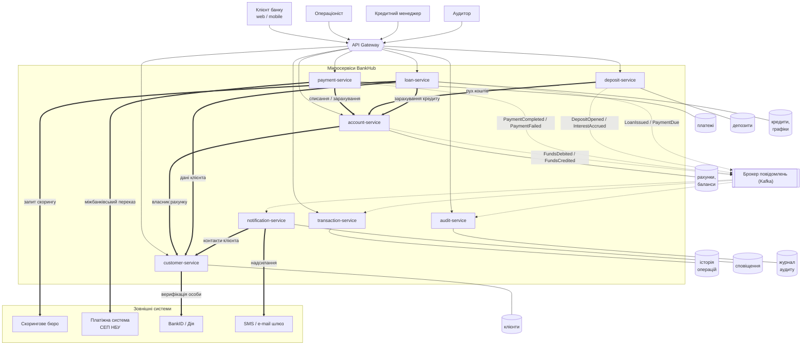

# Лабораторна робота №1

## Аналіз мікросервісної системи та класифікація змін

**Група:** `___________`
**Бригада:** `___________`
**Склад бригади:** `___________`, `___________`, `___________`
**Назва системи:** **Система онлайн банкінгу** — система дистанційного банківського обслуговування клієнтів(з інтеграцією кредитного скорингу).

---

## 1. Опис предметної області (Завдання 1)

### 1.1. Призначення системи

**BankHub** — це система онлайн-банкінгу для фізичних осіб. Клієнт через веб- або мобільний застосунок відкриває рахунки, переказує кошти, оплачує послуги, розміщує депозити та оформлює кредити, не відвідуючи відділення.

Система покриває чотири базові банківські напрями:

- **розрахункове обслуговування** — рахунки, баланси, перекази та платежі;
- **депозитні продукти** — розміщення коштів на строк із нарахуванням відсотків;
- **кредитні продукти** — заявка на кредит, рішення про видачу, погашення за графіком;
- **обслуговування клієнта** — профіль, ідентифікація, сповіщення, історія операцій.

Рішення про видачу кредиту приймається не вручну, а на основі **кредитного скорингу**. На поточному етапі скоринг виконує зовнішній провайдер (скорингове бюро): банк передає йому дані клієнта та параметри заявки і отримує скорбал із рекомендацією. Це свідомо просте рішення — «легка інтеграція», яка в подальшому підлягає заміні на власну модель оцінки ризику (див. розділ 8).

### 1.2. Основні користувачі

| Користувач | Що робить у системі |
|---|---|
| **Клієнт банку (фізична особа)** | Відкриває рахунки та депозити, робить перекази й платежі, подає заявку на кредит, переглядає історію та виписки |
| **Операціоніст** | Обслуговує клієнта у відділенні: реєстрація, відкриття рахунків, розблокування доступу |
| **Кредитний менеджер** | Розглядає заявки, які скоринг відправив на ручне рішення; затверджує або відхиляє кредит |
| **Аудитор / служба безпеки** | Переглядає журнал дій користувачів і операцій, розслідує спірні ситуації |
| **Зовнішні системи** | Скорингове бюро, платіжна система (СЕП НБУ), BankID/Дія, шлюз SMS та e-mail |

### 1.3. Основні функції системи

1. Реєстрація клієнта та ідентифікація через BankID/Дія.
2. Відкриття, перегляд і закриття банківських рахунків, перегляд балансу.
3. Перекази між власними рахунками, іншим клієнтам банку та в інші банки.
4. Оплата послуг за реквізитами (комунальні, мобільний зв'язок тощо).
5. Перегляд історії операцій і формування виписки за період.
6. Відкриття депозиту, нарахування відсотків, повернення коштів після закінчення строку.
7. Подання кредитної заявки, автоматична оцінка кредитоспроможності, видача кредиту.
8. Погашення кредиту за графіком, контроль прострочень.
9. Сповіщення клієнта про операції та події за продуктами.
10. Ведення журналу аудиту всіх значущих дій.

### 1.4. Головні бізнес-сутності

`Клієнт`, `Рахунок`, `Транзакція`, `Платіж`, `Депозит`, `Кредитна заявка`, `Кредит`, `Графік погашення`, `Сповіщення`, `Запис аудиту`.

### 1.5. Типові сценарії роботи користувача

**Сценарій А. Переказ коштів іншому клієнту банку**

1. Клієнт входить у застосунок і обирає «Переказ».
2. Вказує рахунок списання, отримувача та суму 1 500 грн.
3. Система перевіряє, що рахунок активний і на ньому достатньо коштів.
4. Кошти списуються з рахунку відправника та зараховуються на рахунок отримувача.
5. Операція потрапляє в історію обох клієнтів.
6. Обидва клієнти отримують SMS про рух коштів; дія фіксується в журналі аудиту.

**Сценарій Б. Оформлення кредиту**

1. Клієнт подає заявку: 50 000 грн на 12 місяців.
2. Система перевіряє, що клієнт ідентифікований і не має активних прострочень.
3. Заявка надсилається на скоринг; зовнішній сервіс повертає скорбал `712` і рекомендацію «схвалити».
4. Система розраховує ставку та формує графік погашення на 12 платежів.
5. Сума кредиту зараховується на поточний рахунок клієнта.
6. Клієнт отримує сповіщення про видачу кредиту та графік платежів.

---

## 2. Мікросервіси системи (Завдання 2)

### 2.1. Принцип декомпозиції

Сервіси виділено за **бізнес-доменами**: кожен сервіс відповідає за один банківський продукт або одну наскрізну функцію. Межі проведено так, щоб зміна в одному продукті (наприклад, нові умови депозитів) не вимагала зміни інших сервісів.

### 2.2. `customer-service`

- **Призначення:** керування клієнтами банку.
- **Основні функції:** реєстрація клієнта, ідентифікація через BankID/Дія, зберігання та оновлення профілю, зміна контактних даних, блокування клієнта.
- **Дані сервісу:** клієнт (ПІБ, дата народження, ІПН, паспортні дані), контактні дані (телефон, e-mail, адреса), статус ідентифікації, статус клієнта (активний / заблокований).
- **Взаємодії:** викликається `account-service`, `loan-service`, `deposit-service` для перевірки клієнта; викликає зовнішній BankID/Дія.
- **Можливі ризики змін:** зміна структури профілю впливає на всі сервіси, що відображають дані клієнта; блокування клієнта має каскадно зупиняти операції за його продуктами.

### 2.3. `account-service`

- **Призначення:** банківські рахунки та баланси.
- **Основні функції:** відкриття та закриття рахунку, генерація IBAN, перегляд поточного й доступного балансу, списання та зарахування коштів, блокування суми (hold).
- **Дані сервісу:** рахунок (IBAN, тип, валюта, статус, дата відкриття), баланс, заблокована сума, зв'язок із клієнтом.
- **Взаємодії:** викликає `customer-service` (перевірка власника); викликається `payment-service`, `deposit-service`, `loan-service`; публікує події про рух коштів.
- **Можливі ризики змін:** це найкритичніший сервіс — будь-яка помилка в розрахунку балансу означає фінансову втрату; зміна логіки блокування коштів впливає на платежі.

### 2.4. `payment-service`

- **Призначення:** виконання платежів і переказів.
- **Основні функції:** створення платежу, перевірка реквізитів і лімітів, внутрішньобанківський переказ, міжбанківський переказ через платіжну систему, оплата за реквізитами, скасування платежу, відстеження статусу.
- **Дані сервісу:** платіж (сума, валюта, рахунок списання, реквізити отримувача, призначення), статус платежу (`CREATED` → `PROCESSING` → `COMPLETED` / `FAILED`), тип платежу, ключ ідемпотентності.
- **Взаємодії:** викликає `account-service` (списання та зарахування) і `customer-service`; викликає зовнішню платіжну систему; публікує події `PaymentCompleted` / `PaymentFailed`.
- **Можливі ризики змін:** зміна логіки статусів може призвести до подвійного списання; додавання нового каналу платежів зачіпає інтеграцію із зовнішньою системою.

### 2.5. `transaction-service`

- **Призначення:** історія операцій за рахунками та формування виписок.
- **Основні функції:** запис кожної операції за рахунком, пошук і фільтрація історії, формування виписки за період, експорт у PDF/CSV, звірка з балансами рахунків.
- **Дані сервісу:** транзакція (рахунок, сума, напрям — дебет/кредит, тип операції, дата, опис, залишок після операції), виписка.
- **Взаємодії:** споживає події про рух коштів від `account-service`, `payment-service`, `deposit-service`, `loan-service`; дані читає клієнт через API Gateway.
- **Можливі ризики змін:** сервіс містить найбільший обсяг даних, тому зміна структури транзакції потребує міграції мільйонів записів; втрата події означає «дірку» в історії клієнта.

### 2.6. `deposit-service`

- **Призначення:** депозитні продукти.
- **Основні функції:** перегляд умов депозитів, відкриття депозиту, нарахування відсотків, дострокове розірвання, повернення коштів після закінчення строку, автоматична пролонгація.
- **Дані сервісу:** депозитний продукт (назва, ставка, строк, мінімальна сума), депозит клієнта (сума, ставка, дата відкриття та закінчення, статус), нараховані відсотки.
- **Взаємодії:** викликає `customer-service` і `account-service` (списання суми депозиту та повернення з відсотками); публікує події про відкриття депозиту й нарахування відсотків.
- **Можливі ризики змін:** зміна формули нарахування відсотків впливає на вже відкриті депозити; зміна умов продукту не повинна змінювати умови чинних договорів.

### 2.7. `loan-service`

- **Призначення:** кредитні продукти та кредитні заявки.
- **Основні функції:** приймання кредитної заявки, запит скорингу в зовнішньому сервісі, прийняття рішення за результатом скорингу, маршрутизація межових заявок на кредитного менеджера, розрахунок ставки та формування графіка погашення, облік платежів за кредитом, контроль прострочень.
- **Дані сервісу:** кредитна заявка (сума, строк, мета, статус, скорбал, рішення), кредит (сума, ставка, строк, залишок заборгованості, статус), графік погашення (номер платежу, дата, тіло, відсотки), історія погашень.
- **Взаємодії:** викликає `customer-service`, `account-service` (зарахування кредиту та списання платежів), зовнішній скоринговий сервіс; публікує події `LoanIssued`, `PaymentDue`, `LoanOverdue`.
- **Можливі ризики змін:** зміна алгоритму скорингу прямо впливає на кредитний ризик банку; зміна графіка погашення зачіпає вже видані кредити.

### 2.8. `notification-service`

- **Призначення:** сповіщення клієнтів.
- **Основні функції:** формування тексту сповіщення за шаблоном, вибір каналу (SMS, e-mail, push), надсилання через зовнішній шлюз, повторна спроба при помилці, облік налаштувань клієнта щодо каналів.
- **Дані сервісу:** сповіщення (клієнт, канал, текст, статус, дата), шаблон сповіщення, налаштування каналів клієнта.
- **Взаємодії:** споживає події від усіх бізнес-сервісів; викликає зовнішній SMS/e-mail шлюз; запитує контакти в `customer-service`.
- **Можливі ризики змін:** сервіс не критичний для цілісності даних, тому більшість змін тут малоризикові; основний ризик — надсилання неправильного тексту клієнту.

### 2.9. `audit-service`

- **Призначення:** журнал дій і операцій для контролю та розслідувань.
- **Основні функції:** запис усіх значущих подій системи в незмінний (append-only) журнал, пошук за клієнтом, датою та типом події, формування звітів для служби безпеки.
- **Дані сервісу:** запис аудиту (хто, що, коли, з якого пристрою/IP, результат), тип події, посилання на об'єкт операції.
- **Взаємодії:** споживає події від усіх сервісів; дані читає лише аудитор.
- **Можливі ризики змін:** сервіс не змінює бізнес-дані, але його відсутність або втрата подій — це порушення вимог регулятора.

### 2.10. Обґрунтування декомпозиції

**Чому саме такий набір сервісів:**

- `customer-service`, `account-service`, `deposit-service`, `loan-service` — це чотири незалежні бізнес-домени банку. Кожен має власний життєвий цикл сутностей і власні бізнес-правила.
- `payment-service` і `transaction-service` розділені навмисно, хоча стосуються одних і тих самих грошей. `payment-service` відповідає за **виконання операції** (валідація, статуси, взаємодія з платіжною системою), а `transaction-service` — за **зберігання та читання історії**. У них принципово різне навантаження: платежів за день десятки тисяч, а запитів історії — у десятки разів більше, і масштабувати їх потрібно окремо.
- `notification-service` і `audit-service` — наскрізні технічні сервіси. Вони підписані на події всіх бізнес-сервісів. Якби сповіщення надсилав кожен сервіс самостійно, логіка шаблонів і каналів дублювалася б у восьми місцях.

**Чого свідомо не зроблено:**

- Скоринг **не винесено** в окремий сервіс: на цьому етапі це зовнішня інтеграція в межах `loan-service`. Створювати власний сервіс без власної моделі оцінки ризику передчасно.
- Баланс рахунку **не винесено** в окремий сервіс від рахунку: баланс і рахунок мають змінюватися в одній локальній транзакції, інакше система отримала б розподілену транзакцію без жодної потреби.

---

## 3. Дані сервісів і власники сутностей (Завдання 3)

### 3.1. Відповідність «сервіс — дані»

| Сервіс | Сутності, якими володіє |
|---|---|
| `customer-service` | `Клієнт`, `КонтактніДані`, `ДокументиІдентифікації`, `СтатусКлієнта` |
| `account-service` | `Рахунок`, `Баланс`, `БлокуванняКоштів` |
| `payment-service` | `Платіж`, `СтатусПлатежу`, `ЛімітиОперацій` |
| `transaction-service` | `Транзакція`, `Виписка` |
| `deposit-service` | `ДепозитнийПродукт`, `Депозит`, `НарахованіВідсотки` |
| `loan-service` | `КредитнаЗаявка`, `Кредит`, `ГрафікПогашення`, `ІсторіяПогашень` |
| `notification-service` | `Сповіщення`, `ШаблонСповіщення`, `НалаштуванняКаналів` |
| `audit-service` | `ЗаписАудиту` |

Кожен сервіс має **власну базу даних**. Жодна база не є спільною для двох сервісів, і жоден сервіс не звертається до чужої бази напряму — тільки через API або події.

### 3.2. Аналіз проблеми спільних даних

**Чи може два сервіси змінювати одну сутність?**

Ні. Найризикованіше місце — баланс рахунку: його намагаються змінити `payment-service` (переказ), `deposit-service` (відкриття депозиту) і `loan-service` (видача кредиту). Але **жоден із них не пише в баланс напряму** — усі три викликають `account-service`, який є єдиним власником балансу і виконує зміну у своїй локальній транзакції. Це прибирає ризик неузгодженого балансу.

**Які дані потрібні багатьом сервісам?**

Ідентифікатор клієнта `customerId` потрібен усім бізнес-сервісам. Профіль клієнта не дублюється — сервіси зберігають лише ідентифікатор, а ПІБ і контакти за потреби запитують у `customer-service`.

**Чи можна дублювати частину даних?**

Так, у двох місцях дублювання є виправданим:

1. `transaction-service` зберігає копію суми, дати й опису операції, хоча первинні дані є в `payment-service` та `account-service`. Це зроблено навмисно: історія операцій має бути **незмінною** і доступною навіть тоді, коли платіж було скасовано або рахунок закрито.
2. `notification-service` зберігає текст уже надісланого сповіщення разом зі значеннями, підставленими в шаблон. Клієнт має бачити рівно те, що йому надіслали, навіть якщо шаблон згодом змінили.

**Хто є основним власником кожної сутності?**

Кожна сутність має рівно одного сервіс-власника (таблиця 3.1). Правило просте: **дані змінює тільки той сервіс, який ними володіє**; усі інші читають їх через API або отримують через події.

**Висновок.** Проблеми спільної бази даних у системі немає. Основна залежність — `customer-service`, до якого звертаються майже всі сервіси. Щоб він не став вузьким місцем, дані клієнта, потрібні для відображення (ПІБ, телефон), кешуються на стороні викликача з коротким часом життя.

---

## 4. Взаємодії між сервісами (Завдання 4)

### 4.1. Перелік взаємодій

| № | Ініціатор | Отримувач | Тип взаємодії | Мета та дані | Критична |
|---|---|---|---|---|---|
| 1 | API Gateway | `customer-service` | синхронний REST | реєстрація, вхід, профіль клієнта | **так** |
| 2 | `customer-service` | BankID / Дія | зовнішній API | верифікація особи клієнта | **так** |
| 3 | `account-service` | `customer-service` | синхронний REST | перевірка власника рахунку; `customerId` → статус клієнта | **так** |
| 4 | `payment-service` | `account-service` | синхронний REST | списання та зарахування коштів; рахунок, сума | **так** |
| 5 | `payment-service` | Платіжна система (СЕП) | зовнішній API | міжбанківський переказ; реквізити, сума | **так** |
| 6 | `account-service` | брокер повідомлень | подія `FundsDebited` / `FundsCredited` | рух коштів за рахунком; рахунок, сума, дата, залишок | **так** |
| 7 | `transaction-service` | ← брокер | споживання подій руху коштів | запис операції в історію | **так** |
| 8 | `payment-service` | брокер повідомлень | подія `PaymentCompleted` / `PaymentFailed` | результат платежу | ні |
| 9 | `deposit-service` | `account-service` | синхронний REST | списання суми депозиту, повернення з відсотками | **так** |
| 10 | `deposit-service` | брокер повідомлень | подія `DepositOpened` / `InterestAccrued` | події за депозитом | ні |
| 11 | `loan-service` | Скорингове бюро | зовнішній API | оцінка кредитоспроможності; дані клієнта → скорбал, рекомендація | **так**, із деградацією |
| 12 | `loan-service` | `account-service` | синхронний REST | зарахування кредиту, списання щомісячного платежу | **так** |
| 13 | `loan-service` | брокер повідомлень | подія `LoanIssued` / `PaymentDue` / `LoanOverdue` | події за кредитом | ні |
| 14 | `notification-service` | ← брокер | споживання подій усіх сервісів | формування та надсилання сповіщення | ні |
| 15 | `notification-service` | SMS / e-mail шлюз | зовнішній API | надсилання повідомлення клієнту | ні |
| 16 | `audit-service` | ← брокер | споживання подій усіх сервісів | запис у журнал аудиту | ні (обов'язкова за вимогами регулятора) |
| 17 | API Gateway | `transaction-service` | синхронний REST | перегляд історії та виписки | ні |

### 4.2. Критичні взаємодії

**Критичний шлях переказу:** `payment-service` → `account-service` → подія `FundsDebited` → `transaction-service`. Якщо будь-яка ланка не спрацює, клієнт або не отримає гроші, або не побачить операцію в історії.

**Критичний шлях кредиту:** `loan-service` → скорингове бюро → `account-service`. Відмова зовнішнього скорингу зупиняє видачу кредитів.

Три місця, де застосовано **деградацію замість повної відмови**:

- **Взаємодія 11 (скоринг).** Зовнішній сервіс має власний SLA, на який банк не впливає. При недоступності спрацьовує запобіжник (circuit breaker), і всі заявки маршрутизуються на ручний розгляд кредитним менеджером замість автоматичної відмови.
- **Взаємодія 15 (SMS-шлюз).** Якщо шлюз недоступний, сповіщення залишається в черзі з повторними спробами. Операція при цьому вважається успішною.
- **Взаємодія 5 (платіжна система).** Міжбанківський переказ переходить у статус `PROCESSING` і повторюється пізніше, кошти при цьому залишаються заблокованими.

**Роль асинхронних взаємодій.** Події (6, 8, 10, 13) знімають часову зв'язаність: `account-service` не чекає, поки `transaction-service`, `notification-service` й `audit-service` обробили операцію. Завдяки цьому падіння сервісу сповіщень або аудиту **не зупиняє рух коштів**.

---

## 5. Архітектурна схема (Завдання 5)

**Позначення:** жирна стрілка `==>` — синхронний виклик REST, пунктирна `-.->` — асинхронна подія через брокер, суцільна лінія `---` — власна база даних сервісу.

**Пояснення схеми.** Усі запити користувачів проходять через API Gateway, який приховує внутрішню структуру системи. У центрі — `account-service`: до нього звертаються всі сервіси, що рухають кошти (платежі, депозити, кредити), і лише він змінює баланси. Праворуч — зовнішні системи, з якими банк інтегрується. Внизу — брокер повідомлень: бізнес-сервіси публікують у нього події, а `transaction-service`, `notification-service` та `audit-service` їх споживають. Завдяки цьому три сервіси-споживачі нічого не знають про сервіси-джерела, і додавання нового споживача не вимагає зміни решти системи.

---

## 6. Перелік можливих змін (Завдання 6)

| № | Зміна | Короткий опис |
|---|---|---|
| 1 | Власний сервіс кредитного скорингу | Замінити зовнішнє скорингове бюро на власний сервіс оцінки кредитного ризику на основі поведінкових даних клієнта |
| 2 | Мультивалютні рахунки | Додати рахунки в USD та EUR, конвертацію за курсом, зберігання валюти в усіх грошових полях |
| 3 | Кредитні картки | Додати новий кредитний продукт із кредитним лімітом, пільговим періодом і мінімальним платежем |
| 4 | Регулярні платежі | Дозволити клієнту налаштувати автоматичний платіж за розкладом (щомісяця, щотижня) |
| 5 | Дострокове погашення кредиту | Дозволити часткове або повне дострокове погашення з автоматичним перерахунком графіка |
| 6 | Push-сповіщення та месенджери | Додати канали push і Viber до наявних SMS та e-mail, дати клієнту вибір каналу |
| 7 | Ідемпотентність API платежів | Додати обов'язковий ключ ідемпотентності в запит створення платежу, щоб повтор запиту не призводив до подвійного списання |
| 8 | Ліміти та антифрод | Додати перевірку добових лімітів і базові антифрод-правила перед виконанням платежу |
| 9 | Двофакторне підтвердження операцій | Вимагати підтвердження SMS-кодом для переказів понад визначену суму |
| 10 | Автоматична пролонгація депозиту | Продовжувати депозит на новий строк за чинною ставкою, якщо клієнт не забрав кошти |
| 11 | Категоризація витрат | Додати автоматичну категорію до кожної транзакції («продукти», «транспорт») і аналітику витрат клієнта |
| 12 | Асинхронна обробка переказів | Перевести міжбанківські перекази з синхронного очікування на обробку через чергу з наступним повідомленням клієнта |
| 13 | Окремий сервіс виписок | Винести формування виписок і звітів з `transaction-service` в окремий сервіс через високе навантаження на читання |
| 14 | Об'єднання `payment-service` і `transaction-service` | Розглянути злиття двох сервісів, щоб прибрати асинхронну затримку появи операції в історії |

---

## 7. Класифікація змін (Завдання 7)

| № | Тип зміни | Складність | Ризик | Сервісів | Сумісність зі старою версією | Міграція даних | Зміна API | Додаткове тестування |
|---|---|---|---|---|---|---|---|---|
| 1 | новий сервіс, бізнес-логіка, дані, інтеграція | висока | **високий** | 4 (`loan`, новий `scoring`, `transaction`, `customer`) | так | так | так | так |
| 2 | дані, бізнес-логіка, API | висока | **високий** | 5 (`account`, `payment`, `transaction`, `deposit`, `loan`) | ні | **так** | так | так |
| 3 | новий продукт, бізнес-логіка, дані | висока | середній | 3 (`loan`, `account`, `transaction`) | так | ні | так | так |
| 4 | бізнес-логіка, дані | середня | середній | 2 (`payment`, `notification`) | так | ні | так | так |
| 5 | бізнес-логіка | середня | середній | 2 (`loan`, `account`) | так | ні | так | так |
| 6 | інфраструктура, інтеграція | низька | низький | 1 (`notification`) | так | ні | ні | так |
| 7 | API | низька | **високий** | 2 (`payment`, клієнтські застосунки) | **ні** | ні | так | так |
| 8 | бізнес-логіка, безпека | середня | високий | 2 (`payment`, `customer`) | так | ні | ні | так |
| 9 | безпека, взаємодія | середня | середній | 3 (`payment`, `customer`, `notification`) | ні | ні | так | так |
| 10 | бізнес-логіка | низька | низький | 1 (`deposit`) | так | ні | ні | так |
| 11 | дані, бізнес-логіка | середня | низький | 1 (`transaction`) | так | так (backfill) | так | так |
| 12 | взаємодія між сервісами | висока | високий | 3 (`payment`, `account`, `notification`) | ні | ні | так | так |
| 13 | новий сервіс, продуктивність | середня | середній | 2 (`transaction`, новий) | так | так (реплікація) | так | так |
| 14 | об'єднання сервісів | висока | середній | 2 (`payment`, `transaction`) | так | так | ні | так |

### Пояснення ризиків

- **№1 (високий).** Скоринг прямо визначає, кому банк дає гроші. Помилка в моделі не викликає збою системи — вона просто видає правдоподібні, але неправильні оцінки, і наслідки видно лише через місяці у вигляді зростання прострочень. Потрібен паралельний запуск із порівнянням результатів.
- **№2 (високий).** Валюта зачіпає **кожне грошове поле в системі**: баланси, платежі, транзакції, депозити, кредити. Це найширша зміна з усього переліку, вона несумісна зі старими даними й потребує міграції всіх існуючих записів.
- **№7 (високий при низькій складності).** Технічно це одне нове поле в запиті. Але якщо зробити його обов'язковим, усі наявні клієнтські застосунки одразу перестануть працювати. Класичний приклад того, що складність і ризик не пов'язані між собою.
- **№8, №9 (високий і середній).** Зміни у сфері безпеки. Надто жорсткі правила блокують законні операції клієнтів, надто м'які — не захищають. Помилка помітна одразу, але дорога репутаційно.
- **№12 (високий).** Ламає очікування клієнта «натиснув — одразу побачив результат». Потрібно перебудувати не лише код, а й інтерфейс і логіку статусів.
- **№3, №4, №5, №13, №14 (середній).** Зміни зачіпають 2–3 сервіси, але залишаються зворотно сумісними. Основний ризик — у розрахунках (графік погашення, дати платежів), тому потрібне ретельне тестування бізнес-логіки.
- **№6, №10, №11 (низький).** Зміни ізольовані в межах одного сервісу й нічого не ламають у решті системи.

---

## 8. Обрана зміна для подальших лабораторних робіт (Завдання 8)

### 8.1. Назва зміни

**Впровадження власного сервісу кредитного скорингу на основі поведінкових даних клієнта** (зміна №1).

### 8.2. Суть зміни

Зараз `loan-service` під час розгляду заявки звертається до зовнішнього скорингового бюро: передає дані клієнта й параметри заявки і отримує скорбал із рекомендацією «схвалити / відхилити / розглянути вручну».

Зміна полягає в тому, щоб замінити цю зовнішню інтеграцію **власним сервісом `scoring-service`**, який оцінює кредитоспроможність клієнта на основі даних, які банк уже має:

- **поведінка за рахунками** — регулярність надходжень, стабільність доходу, середній залишок на рахунку, частота овердрафтів (дані з `transaction-service`);
- **платіжна дисципліна** — історія погашень за попередніми кредитами (дані з `loan-service`);
- **профіль клієнта** — вік, строк обслуговування в банку, набір продуктів (дані з `customer-service`).

Замість одного числа сервіс повертає скорбал, рівень ризику й **перелік основних факторів рішення**, які показуються клієнту в разі відмови.

### 8.3. Чому вона потрібна

1. **Вартість.** Банк платить бюро за кожен запит; при зростанні кількості заявок це відчутні витрати.
2. **Якість оцінки.** Зовнішнє бюро не бачить, як клієнт поводиться зі своїми рахунками саме в цьому банку. Для клієнтів без кредитної історії внутрішні поведінкові дані — часто єдине надійне джерело оцінки.
3. **Залежність від зовнішньої системи.** Зараз недоступність бюро зупиняє автоматичну видачу кредитів.
4. **Контроль над правилами.** Власну модель можна змінювати під кредитну політику банку, зовнішню — ні.

### 8.4. Попередньо зачеплені сервіси

| Сервіс | Характер змін |
|---|---|
| **`scoring-service` (новий)** | Повністю новий сервіс: збір ознак, розрахунок скорбалу, зберігання результатів оцінки |
| `loan-service` | Основний: замінити виклик зовнішнього API на виклик внутрішнього сервісу, обробити нову структуру відповіді з факторами рішення |
| `transaction-service` | Додати API для отримання агрегованих показників за рахунком клієнта (надходження, витрати, залишки за період) |
| `customer-service` | Додати API для отримання даних, потрібних для оцінки: вік, дата початку обслуговування, перелік продуктів |
| `notification-service` | Додати шаблон сповіщення про відмову з поясненням причини |
| `audit-service` | Обов'язково фіксувати кожну оцінку: які дані використано і яке рішення прийнято |

### 8.5. Які дані можуть змінитися

- **Нові сутності** в `scoring-service`: `ОцінкаКредитоспроможності` (клієнт, заявка, скорбал, рівень ризику, дата), `ФакторРішення` (назва фактора, вплив), `НабірПравил` (версія моделі, порогові значення).
- **Нові поля** в сутності `КредитнаЗаявка` (`loan-service`): `scoringId`, `scoreValue`, `riskLevel`, `scoringSource` (`EXTERNAL` / `INTERNAL`).
- **Нові агрегати** в `transaction-service`: показники за рахунком клієнта за 3/6/12 місяців. Для існуючих клієнтів їх треба порахувати заднім числом (backfill) за історією операцій.
- **Міграція:** усі наявні заявки позначаються як `scoringSource = EXTERNAL`.

### 8.6. Які API можуть змінитися

- **Нове API** `scoring-service`: `POST /scoring/evaluate` (заявка → скорбал, рівень ризику, фактори), `GET /scoring/{id}`.
- **`transaction-service`:** нова кінцева точка `GET /accounts/{id}/aggregates?period=12m` — адитивна зміна, наявні клієнти не зачіпаються.
- **`customer-service`:** розширення відповіді профілю полями `clientSince` і `productList` — адитивна зміна.
- **`loan-service`:** у відповіді на заявку з'являються поля `riskLevel` і `decisionFactors`; зовнішній API для клієнта залишається зворотно сумісним.
- **Нова подія** `CreditScoreCalculated` — її споживають `audit-service` і `notification-service`.

### 8.7. Ризики, видимі вже на цьому етапі

1. **Неправильні кредитні рішення.** Модель може систематично завищувати або занижувати оцінку. Це не викликає збою — система працює, але банк втрачає гроші. Наслідки видно через 6–12 місяців.
2. **Зростання часу відповіді.** Зараз один зовнішній виклик, після зміни — три внутрішні (`transaction`, `customer`, розрахунок). Заявка може оброблятися помітно довше.
3. **Навантаження на `transaction-service`.** Розрахунок агрегатів за 12 місяців по великій таблиці історії може вплинути на швидкість перегляду виписок звичайними клієнтами.
4. **Неповні дані для нових клієнтів.** Для клієнта, який відкрив рахунок тиждень тому, поведінкових даних немає. Потрібне запасне правило — звернення до зовнішнього бюро.
5. **Вимоги до персональних даних.** Використання історії операцій для оцінки кредитоспроможності потребує окремої згоди клієнта.
6. **Неузгоджений реліз.** Якщо `loan-service` оновити раніше, ніж `transaction-service` віддасть нове API, видача кредитів зупиниться.

### 8.8. Чому обрано саме цю зміну

Зміна повністю відповідає вимогам до наступних лабораторних робіт:

| Напрям наступних робіт | Як зміна його покриває |
|---|---|
| Граф залежностей | зачіпає 6 сервісів, з них один новий, і змінює структуру залежностей системи |
| Аналіз впливу зміни | має явні прямі впливи (`loan`) і непрямі (`transaction` — через навантаження) |
| Зміна API | три адитивні зміни + одне нове API + нова подія |
| Міграція даних | backfill агрегатів за історією операцій і позначення наявних заявок |
| Тестування | потрібен паралельний запуск зі старим скорингом і порівняння результатів, навантажувальне тестування `transaction-service` |
| Реліз і моніторинг | поетапне впровадження за перемикачем (feature flag) із можливістю повернення до зовнішнього бюро |

Альтернативи відхилено: зміна №2 (мультивалютність) зачіпає майже всю систему й перетворилася б на окремий проєкт; зміна №7 надто вузька (одне поле в API); зміни №6 і №10 надто прості та ізольовані в одному сервісі.

Додатковий аргумент: ця зміна є практичним продовженням теми магістерського дослідження — моделі оцінки кредитного ризику фізичних осіб на основі поведінкових даних.

---

## 9. Висновки

1. Побудовано початкову аналітичну модель банківської системи **BankHub** — онлайн-банку для фізичних осіб із рахунками, платежами, депозитами та кредитами.

2. Систему декомпоновано на **вісім мікросервісів**: шість бізнес-сервісів (`customer`, `account`, `payment`, `transaction`, `deposit`, `loan`) і два наскрізні технічні (`notification`, `audit`). Межі проведено за бізнес-доменами так, щоб зміна умов одного продукту не вимагала зміни інших сервісів.

3. Визначено власників усіх сутностей даних. Головне правило системи: **дані змінює тільки той сервіс, який ними володіє**. Найризикованіше місце — баланс рахунку, який намагаються змінити три різні сервіси; його захищено тим, що всі вони працюють виключно через API `account-service`.

4. Описано 17 взаємодій між сервісами. Критичний шлях руху коштів реалізовано синхронними викликами, а все, що не впливає на цілісність грошей (історія, сповіщення, аудит), — через події. Завдяки цьому падіння сервісу сповіщень або аудиту не зупиняє банківські операції.

5. Для трьох зовнішніх інтеграцій передбачено **деградацію замість повної відмови**: недоступність скорингу переводить заявки на ручний розгляд, недоступність SMS-шлюзу лише відкладає сповіщення, а збій платіжної системи переводить переказ у стан очікування.

6. Сформовано та класифіковано **14 можливих змін**. Аналіз показав, що складність і ризик не корелюють: зміна №7 (ключ ідемпотентності) технічно тривіальна, але має високий ризик через несумісність із наявними клієнтами, тоді як зміна №14 (об'єднання сервісів) технічно складна, але з керованим ризиком.

7. Для подальшого дослідження обрано зміну **«Впровадження власного сервісу кредитного скорингу на основі поведінкових даних»**: вона додає новий сервіс, зачіпає ще п'ять наявних, змінює API та події, потребує міграції даних, окремої стратегії тестування та поетапного релізу з можливістю відкату — тобто дає повний матеріал для наступних лабораторних робіт.
