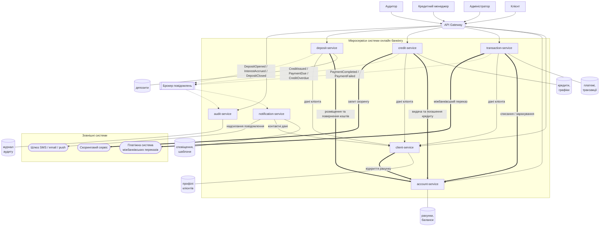

# Звіт до лабораторної роботи 1

**Група:** ІТ-51мн
**Склад бригади:** Кизлюк, Ходос
**Назва системи:** Система онлайн банкінгу

## Завдання 1 - Предметна область мікросервісної системи онлайн банкінгу.

1.1 Система онлайн банкінгу - це система, що надає клієнту можливість виконувати наступні задачі в банку: переказувати кошти на рахунок інших користувачів, здійснювати транзакції для оплати послуг, оформлювати кредити, розміщувати депозити та здійснювати інші фінансові операції онлайн, не відвідуючи банківського відділення.

1.2 Основні користувачі:
- клієнти
- адміністратор
- кредитний менеджер
- аудитор

1.3 Основні функції системи
1. Реєстрація клієнта та ідентифікація.
2. Відкриття, перегляд і закриття банківських рахунків, перегляд балансу.
3. Перекази між власними рахунками, іншим клієнтам банку та в інші банки.
4. Оплата послуг за реквізитами.
5. Перегляд історії операцій і формування виписки за період.
6. Відкриття депозиту, нарахування відсотків, повернення коштів після закінчення строку.
7. Подання кредитної заявки, автоматична оцінка кредитоспроможності, видача кредиту.
8. Погашення кредиту за графіком, контроль прострочень.
9. Сповіщення клієнта про операції та події за продуктами.
10. Ведення журналу аудиту всіх значущих дій.

1.4 Головні бізнес-сутності:
- Клієнт
- Рахунок
- Транзакція (платіж)
- Депозит
- Кредитна заявка
- Кредит і графік погашення
- Сповіщення
- Запис аудиту

1.5. Типовий сценарій роботи користувача

Переказ коштів іншому клієнту банку
1. Клієнт входить у застосунок і обирає «Переказ».
2. Вказує рахунок списання, отримувача та суму.
3. Система перевіряє, що рахунок активний і на ньому достатньо коштів.
4. Кошти списуються з рахунку відправника та зараховуються на рахунок отримувача.
5. Операція потрапляє в історію обох клієнтів.
6. Обидва клієнти отримують SMS про рух коштів; дія фіксується в журналі аудиту.

## Завдання 2 - Визначення основних сервісів системи.

client-service - сервіс керування клієнтами банку.
- які дані він зберігає: реєстраційні дані клієнта (ПІБ, місце проживання, дата народження і т.і.), контактні дані, статус (активний/заблокований)
- які операції виконує: реєструє профіль нового клієнта в системі, ідентифікує клієнта, змінює та оновлює дані профілю клієнта, блокує профіль клієнта.
- з якими іншими сервісами взаємодіє: account-service, transaction-service, credit-service, deposit-service, notification-service.

account-service - банківські рахунки та баланси.
- які дані він зберігає: інформацію банківського рахунку (IBAN, валюта, дата відкриття), баланс, заблокована сума.
- які операції виконує: відкриття та закриття рахунку, генерація IBAN, перегляд поточного та доступного балансу, списання та зарахування коштів, блокування суми.
- з якими іншими сервісами взаємодіє: client-service, transaction-service, credit-service, deposit-service.

transaction-service - виконання платежів та переказів
- які дані він зберігає: платіж (сума, валюта, рахунок списання, реквізити отримувача, призначення), статус платежу, тип платежу
- які операції виконує: створення платежу, внутрішньобанківський переказ, міжбанківський переказ, оплата послуги, скасування платежу, відстеження платежу.
- з якими іншими сервісами взаємодіє: account-service для списання та зарахування, client-service за даними клієнта, notification-service і audit-service через брокер повідомлень. Для міжбанківських переказів звертається до зовнішньої платіжної системи.

credit-service - надання кредитних послуг користувачу.
- які дані він зберігає: кредитна заявка (сума, строк, мета), кредит (сума, ставка, строк, залишок заборгованості, статус), графік погашення (номер платежу, дата, відсотки), історія погашень.
- які операції виконує: приймання кредитної заявки, запит скорингу в зовнішньому сервісі, прийняття рішення за результатом скорингу, розрахунок ставки та формування графіка погашення, облік платежів за кредитом, контроль прострочень.
- з якими іншими сервісами взаємодіє: client-service, account-service, notification-service і audit-service через брокер повідомлень. Викликає зовнішній скоринговий сервіс.

deposit-service - надання депозитних послуг.
- які дані він зберігає: депозитний продукт (назва, ставка, строк, мінімальна сума), депозит клієнта (сума, ставка, дата відкриття та закінчення, статус), нараховані відсотки.
- які операції виконує: перегляд умов депозитів, відкриття депозиту, нарахування відсотків, дострокове розірвання, повернення коштів після закінчення строку.
- з якими іншими сервісами взаємодіє: client-service, account-service, notification-service і audit-service через брокер повідомлень.

notification-service - повідомлення клієнта про всі важливі зміни на його акаунті.
- які дані він зберігає: сповіщення (клієнт, канал, текст, статус, дата), шаблони сповіщень, налаштування каналів зв'язку клієнта.
- які операції виконує: формування тексту сповіщення за шаблоном, вибір каналу комунікації (SMS, email, push-message), надсилання через зовнішній шлюз.
- з якими іншими сервісами взаємодіє: споживає події всіх бізнес-сервісів через брокер повідомлень, звертається до client-service за контактними даними.

audit-service - журнал дій та операцій для контролю адміністратором.
- які дані він зберігає: запис аудиту, тип події, посилання на об'єкт операції.
- які операції виконує: запис усіх значущих подій в журнал, формування виписок з історії транзакцій, пошук за клієнтом, датою, типом.
- з якими іншими сервісами взаємодіє: споживає події всіх бізнес-сервісів через брокер повідомлень.

### Обґрунтування декомпозиції

Сервіси виділені за бізнес-доменами. Кожен відповідає або за один банківський продукт, або за одну спільну для всієї системи функцію.

client-service, account-service, credit-service і deposit-service це чотири окремі напрями роботи банку. У кожного свої сутності і свої правила, тому зміна умов депозитів не зачіпає кредити.

transaction-service відокремлений від account-service, хоча обидва працюють з тими самими грошима. Різниця в тому, що transaction-service виконує платіж, а account-service володіє балансом. Навантаження в них теж різне.

notification-service і audit-service підписані на події всіх інших сервісів. Якби кожен сервіс сам надсилав сповіщення, шаблони і канали довелося б дублювати в п'яти місцях.

Скоринг поки що не винесений в окремий сервіс, це зовнішня інтеграція всередині credit-service. Створення власного сервісу скорингу ми розглядаємо як зміну 1 у Завданні 6.

## Завдання 3 - Визначення даних, якими володіє кожен сервіс.

- client-service - профілі клієнтів, контактні дані, статус клієнта
- account-service - рахунки клієнтів, баланси, заблоковані суми
- transaction-service - платежі та перекази, їх статуси і типи
- credit-service - кредитні заявки, кредити, графіки погашення, історія погашень
- deposit-service - депозитні продукти, депозити клієнтів, нараховані відсотки
- notification-service - сповіщення, їх шаблони і налаштування каналу зв'язку користувача
- audit-service - усі значущі події системи

- Чи може два сервіси змінювати одну й ту саму сутність?

Ні. Найбільш ризикове місце це баланс рахунку. Його хочуть змінити transaction-service при переказі, credit-service при видачі кредиту і deposit-service при відкритті депозиту. Але жоден з них не пише в баланс сам, усі три звертаються до account-service.

- Чи є дані, які потрібні багатьом сервісам?

Ідентифікатор клієнта потрібен всім сервісам. За ним кожен сервіс може звернутися до client-service і запитати дані клієнта.

- Чи можна дублювати частину даних між сервісами?

В одному місці дублювання виправдане. audit-service зберігає копію суми, дати і опису операції, хоча первинні дані лежать у transaction-service. Журнал аудиту має залишатися незмінним навіть тоді, коли платіж скасували. В інших випадках дані не дублюються: сервіси тримають тільки ідентифікатор клієнта і запитують решту в client-service.

- Хто є основним власником кожної сутності?

Кожна сутність має одного сервіс-власника. Дані змінює тільки той сервіс, який ними володіє, решта читають їх через API або отримують через події. Спільної бази даних у системі немає, у кожного сервісу своя.

## Завдання 4 - Опис взаємодії між сервісами

Реєстрація/вхід клієнта у свій профіль
- сервіс-ініціатор: API Gateway
- сервіс-отримувач: client-service
- тип взаємодії: синхронний HTTP/REST-виклик
- мету взаємодії: вхід у систему онлайн банкінгу
- які дані передаються: логін і пароль клієнта, у відповідь токен доступу та ідентифікатор клієнта
- чи є ця взаємодія критичною для роботи системи: так

Відкриття рахунку клієнтом
- сервіс-ініціатор: client-service
- сервіс-отримувач: account-service
- тип взаємодії: синхронний HTTP/REST-виклик
- мету взаємодії: створення платіжного рахунку
- які дані передаються: ідентифікатор клієнта, тип рахунку, валюта, у відповідь IBAN і статус рахунку
- чи є ця взаємодія критичною для роботи системи: так

Переказ коштів
- сервіс-ініціатор: transaction-service
- сервіс-отримувач: account-service
- тип взаємодії: синхронний HTTP/REST-виклик
- мету взаємодії: списання та зарахування коштів
- які дані передаються: сума, рахункові дані
- чи є ця взаємодія критичною для роботи системи: так

Міжбанківський переказ
- сервіс-ініціатор: transaction-service
- сервіс-отримувач: зовнішня платіжна система
- тип взаємодії: зовнішній API-виклик
- мету взаємодії: переказ коштів на рахунок в іншому банку
- які дані передаються: IBAN отримувача, сума, призначення платежу, у відповідь статус переказу
- чи є ця взаємодія критичною для роботи системи: так

Отримання даних клієнта для платежу
- сервіс-ініціатор: transaction-service
- сервіс-отримувач: client-service
- тип взаємодії: читання довідкових даних
- мету взаємодії: перевірити статус клієнта і отримати його дані для платіжного документа
- які дані передаються: ідентифікатор клієнта, у відповідь ПІБ і статус клієнта
- чи є ця взаємодія критичною для роботи системи: ні

Списання суми депозиту та повернення її з відсотками
- сервіс-ініціатор: deposit-service
- сервіс-отримувач: account-service
- тип взаємодії: синхронний HTTP/REST-виклик
- мету взаємодії: виконання функції депозиту
- які дані передаються: дані акаунту користувача, сума до та після депозиту.
- чи є ця взаємодія критичною для роботи системи: так

Отримання даних клієнта для депозиту
- сервіс-ініціатор: deposit-service
- сервіс-отримувач: client-service
- тип взаємодії: читання довідкових даних
- мету взаємодії: перевірити, що клієнт активний і має право відкрити депозит
- які дані передаються: ідентифікатор клієнта, у відповідь статус клієнта
- чи є ця взаємодія критичною для роботи системи: ні

Оформлення кредиту
- сервіс-ініціатор: credit-service
- сервіс-отримувач: account-service
- тип взаємодії: синхронний HTTP/REST-виклик
- мету взаємодії: зарахування суми кредиту та списувати щомісячні платежі
- які дані передаються: дані акаунту користувача, сума до та після взяття кредиту.
- чи є ця взаємодія критичною для роботи системи: так

Запит скорингу за кредитною заявкою
- сервіс-ініціатор: credit-service
- сервіс-отримувач: зовнішній скоринговий сервіс
- тип взаємодії: зовнішній API-виклик
- мету взаємодії: оцінити кредитоспроможність клієнта перед прийняттям рішення за заявкою
- які дані передаються: дані клієнта, сума та строк кредиту, у відповідь скорбал і рекомендація
- чи є ця взаємодія критичною для роботи системи: так

Отримання даних клієнта для кредитної заявки
- сервіс-ініціатор: credit-service
- сервіс-отримувач: client-service
- тип взаємодії: читання довідкових даних
- мету взаємодії: отримати дані клієнта, потрібні для розгляду заявки
- які дані передаються: ідентифікатор клієнта, у відповідь вік, статус ідентифікації, статус клієнта
- чи є ця взаємодія критичною для роботи системи: ні

Повідомлення про платіж
- сервіс-ініціатор: transaction-service
- сервіс-отримувач: брокер повідомлень
- тип взаємодії: асинхронна подія PaymentCompleted / PaymentFailed
- мету взаємодії: повідомити систему про результат виконання платежу
- які дані передаються: дані користувача, сума, статус платежу
- чи є ця взаємодія критичною для роботи системи: ні

Повідомлення щодо депозиту
- сервіс-ініціатор: deposit-service
- сервіс-отримувач: брокер повідомлень
- тип взаємодії: асинхронна подія DepositOpened / InterestAccrued / DepositClosed
- мету взаємодії: повідомлення про дії за депозитом
- які дані передаються: дані користувача, сума, депозитні нарахування
- чи є ця взаємодія критичною для роботи системи: ні

Повідомлення щодо кредиту
- сервіс-ініціатор: credit-service
- сервіс-отримувач: брокер повідомлень
- тип взаємодії: асинхронна подія CreditIssued / PaymentDue / CreditOverdue
- мету взаємодії: повідомлення про дії за кредитом
- які дані передаються: дані користувача, сума, кредитні списання
- чи є ця взаємодія критичною для роботи системи: ні

Формування повідомлення про подію
- сервіс-ініціатор: брокер
- сервіс-отримувач: notification-service
- тип взаємодії: асинхронна подія
- мету взаємодії: формування повідомлення за шаблоном щодо події
- які дані передаються: дані користувача, деталі події
- чи є ця взаємодія критичною для роботи системи: ні

Отримання контактних даних клієнта
- сервіс-ініціатор: notification-service
- сервіс-отримувач: client-service
- тип взаємодії: читання довідкових даних
- мету взаємодії: дізнатися, на який номер або адресу надсилати повідомлення
- які дані передаються: ідентифікатор клієнта, у відповідь телефон, email, дозволені канали
- чи є ця взаємодія критичною для роботи системи: ні

Надсилання повідомлення про подію
- сервіс-ініціатор: notification-service
- сервіс-отримувач: зовнішній шлюз SMS / email / push
- тип взаємодії: зовнішній API-виклик
- мету взаємодії: надсилання сформованого повідомлення про подію
- які дані передаються: повідомлення про подію
- чи є ця взаємодія критичною для роботи системи: ні

Запис в журнал аудиту
- сервіс-ініціатор: брокер
- сервіс-отримувач: audit-service
- тип взаємодії: асинхронна подія
- мету взаємодії: запис події в журнал аудиту
- які дані передаються: тип події, об'єкт операції, час, результат виконання події
- чи є ця взаємодія критичною для роботи системи: ні

### Критичні взаємодії

Всього описано 17 взаємодій, з них 7 критичних.

Критичний шлях переказу коштів: клієнт, далі transaction-service, далі account-service. Для міжбанківського переказу до цього додається виклик зовнішньої платіжної системи.

Критичний шлях видачі кредиту: клієнт, далі credit-service, далі зовнішній скоринговий сервіс, далі account-service.

Читання даних у client-service ми позначили як некритичне. Якщо цей сервіс тимчасово недоступний, операцію можна обробити пізніше, гроші при цьому не зупиняються.

Взаємодії через брокер теж некритичні. notification-service і audit-service обробляють подію вже після того, як операція виконана, тому їх відмова нічого не блокує.

## Завдання 5 - Початкова архітектурна схема системи

Позначення на схемі:

- жирна стрілка `==>` - критична синхронна взаємодія, без якої операція не може бути виконана
- тонка стрілка `-->` - некритичний синхронний виклик, читання довідкових даних
- пунктирна стрілка `-.->` - асинхронна подія через брокер повідомлень
- суцільна лінія без стрілки `---` - власна база даних сервісу

Пояснення схеми.

Запити користувачів ідуть через API Gateway, щоб клієнтський застосунок не залежав від конкретних сервісів.

У центрі схеми account-service. До нього звертаються всі, хто рухає гроші: transaction-service при переказі, credit-service при видачі кредиту, deposit-service при відкритті депозиту. Баланс змінює тільки account-service, доступу до його бази в інших сервісів немає. Через це два сервіси не можуть одночасно змінити один баланс і зробити його неузгодженим.

Друге місце, від якого залежать майже всі, це client-service. До нього звертаються за даними клієнта transaction-service, credit-service і deposit-service, а за контактами notification-service. Ці виклики показані тонкою стрілкою, бо вони тільки читають дані.

notification-service і audit-service ніхто не викликає напряму. Вони підписані на брокер і отримують події від transaction-service, credit-service і deposit-service. Сервіс, який виконав операцію, не чекає, поки клієнту надішлють SMS і зроблять запис в журнал. Тому якщо сповіщення або аудит впадуть, гроші все одно рухатимуться. Нового споживача подій теж можна додати, не чіпаючи наявні сервіси.

У кожного сервісу своя база даних. Спільних баз немає, і жоден сервіс не лізе в чужу базу напряму, тільки через API або через події.

Окремо показані зовнішні системи: скоринговий сервіс, платіжна система для міжбанківських переказів і шлюз для SMS, email та push.

## Завдання 6 - Перелік можливих змін системи

### 1. Додавання підсистеми кредитного скорингу
Створення власної системи кредитного скорингу для автоматизації прийняття рішень щодо заявок на отримання кредиту.

### 2. Розділення transaction-service на payment-service і transaction-service
Зараз transaction-service і виконує платежі, і зберігає дані про них, а виписки з історії формує audit-service. Пропонується розділити ці ролі. payment-service виконує саму платіжну операцію, а transaction-service зберігає історію операцій і віддає її клієнту. Платежів за день десятки тисяч, а запитів історії в десятки разів більше, тому масштабувати ці частини треба окремо. audit-service залишається, але веде тільки журнал дій користувачів і більше не займається виписками.

### 3. Змінити API створення заявки на кредит
Розширення форми заявки на кредит, яка одразу буде надсилатися в сервіс скорингу для оцінки кредитоспроможності клієнта.

### 4. Додати інтеграцію з PayPal
Інтегрувати взаємодію PayPal з рахунками клієнта в банківській системі.

### 5. Додати рахунки в інших валютах
Дозволити клієнту відкривати окремі рахунки в USD та EUR, додати конвертацію за курсом під час переказів між рахунками в різних валютах.

### 6. Створення кредитних карток
Додати новий кредитний продукт із кредитним лімітом, пільговим періодом і мінімальним платежем.

### 7. Створення функціоналу для регулярних платежів
Дозволити клієнту налаштувати автоматичний платіж за розкладом.

### 8. Додавання категоризації витрат
Додати автоматичну категорію до кожної транзакції (продукти, транспорт, розваги) і аналітику витрат клієнта.

### 9. Двофакторне підтвердження операцій
Запит на перевірку достовірності переказу при перевищенні встановленого обмеження суми транзакції.

### 10. Ліміти та антифрод
Додати перевірку добових лімітів і базові антифрод-правила перед виконанням платежу.

## Завдання 7 - Категоризація змін

### 1. Додавання підсистеми кредитного скорингу

Тип зміни:
- бізнес-логіка;
- додавання нового сервісу;
- дані;
- взаємодія між сервісами.

Рівень складності: високий

Рівень ризику: високий

Ймовірно зачеплені сервіси (6):
- scoring-service (новий)
- credit-service
- transaction-service
- client-service
- notification-service
- audit-service

Чи є зміна сумісною зі старою версією системи: так, зовнішній скоринговий сервіс залишається запасним варіантом і вмикається, якщо власна підсистема недоступна або даних про клієнта замало
Чи потребує зміна міграції даних: так, треба заднім числом порахувати поведінкові показники клієнтів за наявною історією транзакцій і позначити раніше подані заявки як оцінені зовнішнім сервісом
Чи потребує зміна оновлення API: так, з'являється нове API оцінки кредитоспроможності, а відповідь credit-service розширюється рівнем ризику та факторами рішення
Чи потребує зміна додаткового тестування: так, потрібен паралельний запуск власного й зовнішнього скорингу з порівнянням результатів і навантажувальне тестування transaction-service

Ризик
високий

Обґрунтування ризику
Скоринг вирішує, кому банк дає гроші. Помилка в моделі не ламає систему, вона просто видає правдоподібні, але неправильні оцінки. Побачити це можна буде тільки через кілька місяців, коли виросте кількість прострочень. Окремо додає ризику навантаження на transaction-service: рахувати показники за рік по великій таблиці історії довго, і це може сповільнити перегляд виписок звичайним клієнтам.

### 2. Розділення transaction-service на payment-service і transaction-service

Тип зміни:
- додавання нового сервісу;
- дані;
- взаємодія між сервісами;
- вимоги до продуктивності.

Рівень складності: високий

Рівень ризику: середній

Ймовірно зачеплені сервіси (4):
- payment-service (новий)
- transaction-service
- audit-service
- account-service

Чи є зміна сумісною зі старою версією системи: так, для клієнта нічого не змінюється, старі ендпоінти можна тимчасово залишити як проксі на нові сервіси
Чи потребує зміна міграції даних: так, історію транзакцій треба перенести з бази audit-service у базу transaction-service, зберігши повноту і хронологію записів
Чи потребує зміна оновлення API: так, платіжні методи переїжджають у payment-service, а методи історії і виписок у transaction-service
Чи потребує зміна додаткового тестування: так, треба перевірити повноту перенесених даних, роботу системи в перехідний період і витримати навантаження в десятки тисяч запитів на день

Ризик
середній

Обґрунтування ризику
Сама логіка платежу не змінюється, тому втратити гроші через цю зміну не вийде. Ризик в іншому. Треба перенести історію транзакцій з бази audit-service, і якщо частина записів загубиться або продублюється, виписка не збігатиметься з балансом рахунку, а довести правильність операцій буде важко. Крім того, поки старий і новий сервіси працюють паралельно, один платіж може записатися в історію двічі, тому обробка подій у transaction-service має бути ідемпотентною.

### 3. Змінити API створення заявки на кредит

Тип зміни:
- зміна API;
- бізнес-логіка;
- взаємодія між сервісами.

Рівень складності: середній

Рівень ризику: високий

Ймовірно зачеплені сервіси (3):
- credit-service
- зовнішній скоринговий сервіс, або scoring-service, якщо реалізовано зміну 1
- client-service

Чи є зміна сумісною зі старою версією системи: ні, у запиті з'являються нові обов'язкові поля для оцінки кредитоспроможності, тому старі версії клієнтських застосунків перестануть працювати
Чи потребує зміна міграції даних: ні, структура вже поданих заявок не змінюється, нові поля заповнюються тільки для нових заявок
Чи потребує зміна оновлення API: так, це і є суть зміни, розширення запиту на створення заявки та негайне надсилання її на скоринг
Чи потребує зміна додаткового тестування: так, потрібні контрактні тести API і перевірка роботи мобільного та веб-застосунку зі старою і новою версією

Ризик
високий

Обґрунтування ризику
Технічно тут роботи небагато, кілька нових полів у запиті. Але зміна несумісна зі старою версією. Якщо мобільний застосунок оновиться пізніше за сервер, клієнти взагалі не зможуть подати заявку на кредит. Це якраз той випадок, коли проста зміна має високий ризик. Щоб його зменшити, можна якийсь час тримати дві версії ендпоінта.

### 4. Додати інтеграцію з PayPal

Тип зміни:
- зміна інтеграції із зовнішньою системою;
- бізнес-логіка;
- дані;
- зміна API.

Рівень складності: високий

Рівень ризику: високий

Ймовірно зачеплені сервіси (4):
- transaction-service
- account-service
- client-service
- notification-service

Чи є зміна сумісною зі старою версією системи: так, це новий спосіб поповнення та виведення коштів, наявні перекази й платежі працюють без змін
Чи потребує зміна міграції даних: ні, додаються нові сутності для прив'язки акаунта PayPal та зовнішніх операцій, наявні дані не чіпаються
Чи потребує зміна оновлення API: так, нові методи прив'язки акаунта PayPal, поповнення та виведення коштів
Чи потребує зміна додаткового тестування: так, потрібне тестування в пісочниці PayPal і перевірка сценаріїв повернення коштів, відмови платежу та повторного надсилання запиту

Ризик
високий

Обґрунтування ризику
Тут ідеться про реальні гроші, які проходять через систему, на яку банк ніяк не впливає. PayPal може підтвердити операцію із затримкою або надіслати сповіщення про неї повторно. Якщо не захиститися від повторів, кошти зарахуються двічі. Додають складності конвертація валют, комісії і механізм повернення платежу, якого в системі зараз взагалі немає. Тому операції обов'язково мають бути ідемпотентними, а дані треба регулярно звіряти з PayPal.

### 5. Додати рахунки в інших валютах

Тип зміни:
- бізнес-логіка;
- дані;
- зміна API;
- зміна інтеграції із зовнішньою системою, джерело курсів валют.

Рівень складності: середній

Рівень ризику: середній

Ймовірно зачеплені сервіси (3):
- account-service
- transaction-service
- notification-service

Чи є зміна сумісною зі старою версією системи: так, поле валюти вже передбачене у структурі рахунку, наявні гривневі рахунки працюють без змін
Чи потребує зміна міграції даних: ні, валюта наявних рахунків уже проставлена, додається тільки нова сутність курсів валют
Чи потребує зміна оновлення API: так, при відкритті рахунку валюта стає явним параметром, а в переказі з'являються курс і сума після конвертації
Чи потребує зміна додаткового тестування: так, потрібні тести конвертації за курсом, округлення і переказу між рахунками в різних валютах

Ризик
середній

Обґрунтування ризику
Зберігати валюту неважко, поле для неї вже є. Складність починається з переказів між рахунками в різних валютах. Треба вирішити, за яким курсом і на який момент рахувати конвертацію і як округлювати результат. Помилка в копійках при великій кількості операцій дає помітну розбіжність. Ще система починає залежати від зовнішнього джерела курсів. Якщо воно недоступне, конвертацію краще заблокувати, ніж рахувати за старим курсом. Ризик середній, бо гривневі операції, а їх більшість, не змінюються.

### 6. Створення кредитних карток

Тип зміни:
- бізнес-логіка;
- дані;
- зміна API;
- взаємодія між сервісами.

Рівень складності: високий

Рівень ризику: середній

Ймовірно зачеплені сервіси (4):
- credit-service
- account-service
- transaction-service
- notification-service

Чи є зміна сумісною зі старою версією системи: так, це окремий новий продукт, наявні кредити з графіком погашення працюють без змін
Чи потребує зміна міграції даних: ні, додаються нові сутності кредитної картки та її операцій, наявні дані не чіпаються
Чи потребує зміна оновлення API: так, нові методи випуску картки, перегляду доступного ліміту, пільгового періоду та мінімального платежу
Чи потребує зміна додаткового тестування: так, потрібні тести розрахунку пільгового періоду, щоденного нарахування відсотків і мінімального платежу на межах періодів

Ризик
середній

Обґрунтування ризику
Кредитна картка працює зовсім не так, як звичайний кредит. Замість фіксованого графіка погашення тут відновлюваний ліміт, пільговий період і щоденні відсотки. Якщо помилитися в розрахунку пільгового періоду, банк нарахує відсотки клієнту, який їх платити не мав, і це відразу претензії та зіпсована репутація. Ризик усе ж середній, бо новий продукт ізольований і не може зламати наявні кредити чи перекази.

### 7. Створення функціоналу для регулярних платежів

Тип зміни:
- бізнес-логіка;
- дані;
- зміна інфраструктури, планувальник завдань;
- взаємодія між сервісами.

Рівень складності: середній

Рівень ризику: середній

Ймовірно зачеплені сервіси (3):
- transaction-service
- account-service
- notification-service

Чи є зміна сумісною зі старою версією системи: так, звичайні разові платежі виконуються так само, регулярний платіж це надбудова над наявним механізмом
Чи потребує зміна міграції даних: ні, додається нова сутність розкладу платежу, наявні платежі не чіпаються
Чи потребує зміна оновлення API: так, нові методи створення, перегляду, призупинення та скасування регулярного платежу
Чи потребує зміна додаткового тестування: так, потрібні тести спрацювання за розкладом, поведінки при недостатніх коштах і захисту від повторного виконання

Ризик
середній

Обґрунтування ризику
Головна відмінність від звичайного платежу в тому, що операція йде без участі клієнта. Якщо планувальник через збій запуститься двічі, гроші спишуться двічі, і клієнт дізнається про це вже після факту. Тому потрібна ідемпотентність за ключем розклад плюс дата. Ще треба заздалегідь вирішити, що робити при нестачі коштів: скільки разів повторювати спробу і коли остаточно скасувати платіж.

### 8. Додавання категоризації витрат

Тип зміни:
- дані;
- бізнес-логіка;
- зміна API.

Рівень складності: середній

Рівень ризику: низький

Ймовірно зачеплені сервіси (2):
- transaction-service
- audit-service

Чи є зміна сумісною зі старою версією системи: так, категорія це додаткове поле, наявні відповіді API тільки розширюються
Чи потребує зміна міграції даних: так, для наявних транзакцій категорію треба проставити заднім числом, інакше аналітика витрат працюватиме тільки для нових операцій
Чи потребує зміна оновлення API: так, нове поле категорії у відповіді та нові методи аналітики витрат за період
Чи потребує зміна додаткового тестування: так, треба перевірити правила визначення категорії і коректність перерахунку для наявних записів

Ризик
низький

Обґрунтування ризику
Категорія ніяк не впливає на рух коштів, це довідкова інформація для клієнта. Якщо вона визначиться неправильно, нічого не зламається, її просто перерахують. Єдина незручність це міграція великого обсягу наявних транзакцій, яку доведеться робити поступово, щоб не перевантажити базу.

### 9. Двофакторне підтвердження операцій

Тип зміни:
- зміна вимог до безпеки;
- бізнес-логіка;
- зміна API;
- взаємодія між сервісами.

Рівень складності: середній

Рівень ризику: високий

Ймовірно зачеплені сервіси (3):
- transaction-service
- client-service
- notification-service

Чи є зміна сумісною зі старою версією системи: ні, переказ понад установлену суму перестає виконуватися одним запитом і стає двокроковим, тому старі клієнтські застосунки не зможуть його завершити
Чи потребує зміна міграції даних: ні, додається сутність коду підтвердження з коротким часом життя, наявні дані не чіпаються
Чи потребує зміна оновлення API: так, платіж переходить у стан очікування підтвердження, з'являється окремий метод підтвердження кодом
Чи потребує зміна додаткового тестування: так, потрібні тести прострочення коду, повторного надсилання, скасування непідтвердженої операції та сценарію, коли SMS не доходить

Ризик
високий

Обґрунтування ризику
Зміна ламає звичний сценарій платежу. Замість однієї операції з'являється проміжний стан очікування підтвердження, і його треба коректно закривати при таймауті, інакше гроші залишаться заблокованими на рахунку клієнта. Система стає залежною від зовнішнього шлюзу SMS: якщо повідомлення не дійде, клієнт не зможе завершити переказ. Раніше цей шлюз був некритичним, а тепер опиняється на шляху руху коштів.

### 10. Ліміти та антифрод

Тип зміни:
- зміна вимог до безпеки;
- бізнес-логіка;
- дані;
- вимоги до продуктивності.

Рівень складності: середній

Рівень ризику: високий

Ймовірно зачеплені сервіси (4):
- transaction-service
- client-service
- account-service
- notification-service

Чи є зміна сумісною зі старою версією системи: так, для операцій у межах лімітів нічого не змінюється, додаються тільки нові коди помилок при їх перевищенні
Чи потребує зміна міграції даних: ні, додаються нові сутності лімітів і антифрод-правил, наявні дані не чіпаються
Чи потребує зміна оновлення API: так, у відповідь додаються нові коди помилок про перевищення ліміту та блокування операції
Чи потребує зміна додаткового тестування: так, потрібні тести на межових значеннях лімітів, перевірка хибних спрацювань правил і навантажувальне тестування, бо перевірка виконується для кожного платежу

Ризик
високий

Обґрунтування ризику
Перевірка стає на шляху кожного платежу. Якщо вона працює повільно або відмовляє, зупиняються всі перекази в системі. Друга складність це налаштування самих правил: надто жорсткі блокують нормальні операції і клієнти скаржаться, надто м'які не ловлять шахраїв. На відміну від помилки в скорингу, тут помилку видно одразу, але коштує вона репутації. Треба передбачити можливість швидко вимкнути окреме правило без перевипуску сервісу.

## Завдання 8 - Обрана зміна для подальших лабораторних робіт

### 8.1. Назва зміни

Впровадження власного сервісу кредитного скорингу на основі поведінкових даних клієнта, це зміна 1.

### 8.2. Суть зміни

Зараз credit-service під час розгляду заявки звертається до зовнішнього скорингового бюро. Він передає туди дані клієнта і параметри заявки, а отримує скорбал і рекомендацію: схвалити, відхилити або розглянути вручну.

Ідея зміни в тому, щоб замінити цю зовнішню інтеграцію власним сервісом scoring-service. Він оцінює кредитоспроможність за даними, які в банку вже є:

- поведінка за рахунками: регулярність надходжень, стабільність доходу, середні щомісячні обороти, співвідношення надходжень і витрат, дані з transaction-service
- платіжна дисципліна: історія погашень за попередніми кредитами, дані з credit-service
- профіль клієнта: вік, скільки часу клієнт обслуговується в банку, які має продукти, дані з client-service

На відміну від бюро, сервіс повертає не одне число, а скорбал, рівень ризику і перелік основних факторів рішення. Ці фактори показуються клієнту, якщо заявку відхилили.

### 8.3. Чому вона потрібна

1. Вартість. Банк платить бюро за кожен запит, і чим більше заявок, тим дорожче це обходиться.
2. Якість оцінки. Бюро не бачить, як клієнт поводиться зі своїми рахунками саме в цьому банку. Для клієнтів без кредитної історії внутрішні дані часто єдине, на що можна спертися.
3. Залежність від зовнішньої системи. Зараз, якщо бюро недоступне, автоматична видача кредитів зупиняється.
4. Контроль над правилами. Власну модель можна підлаштувати під кредитну політику банку, зовнішню ні.

### 8.4. Попередньо зачеплені сервіси

scoring-service, новий. Збирає ознаки, рахує скорбал, зберігає результати оцінки.

credit-service. Основний сервіс, який змінюється. Замість виклику зовнішнього API викликає внутрішній сервіс і обробляє нову структуру відповіді з факторами рішення.

transaction-service. Додає API, яке віддає агреговані показники за рахунком клієнта: надходження, витрати, обороти за період.

client-service. Додає API з даними для оцінки: вік, дата початку обслуговування, перелік продуктів.

notification-service. Додає шаблон сповіщення про відмову з поясненням причини.

audit-service. Фіксує кожну оцінку: які дані використали і яке рішення прийняли.

### 8.5. Які дані можуть змінитися

- нові сутності в scoring-service: ОцінкаКредитоспроможності (клієнт, заявка, скорбал, рівень ризику, дата), ФакторРішення (назва фактора, вплив), НабірПравил (версія моделі, порогові значення)
- нові поля в сутності КредитнаЗаявка у credit-service: scoringId, scoreValue, riskLevel, scoringSource зі значеннями EXTERNAL або INTERNAL
- нові агрегати в transaction-service: показники за рахунком клієнта за 3, 6 і 12 місяців. Для наявних клієнтів їх треба порахувати заднім числом за історією операцій
- міграція: усі наявні заявки позначаються як scoringSource = EXTERNAL

### 8.6. Які API можуть змінитися

- нове API scoring-service: POST /scoring/evaluate, на вхід заявка, на вихід скорбал, рівень ризику і фактори, та GET /scoring/{id}
- transaction-service: нова кінцева точка GET /accounts/{id}/aggregates?period=12m, зміна адитивна, наявних клієнтів не зачіпає
- client-service: у відповідь профілю додаються поля clientSince і productList, зміна теж адитивна
- credit-service: у відповіді на заявку з'являються поля riskLevel і decisionFactors, зовнішній API для клієнта залишається сумісним
- нова подія CreditScoreCalculated, її споживають audit-service і notification-service

### 8.7. Ризики, видимі вже на цьому етапі

1. Неправильні кредитні рішення. Модель може систематично завищувати або занижувати оцінку. Збою при цьому не буде, система працює, але банк втрачає гроші. Наслідки стануть помітні через півроку або рік.
2. Зростання часу відповіді. Зараз це один зовнішній виклик, а після зміни три внутрішні: transaction-service, client-service і сам розрахунок. Заявка оброблятиметься помітно довше.
3. Навантаження на transaction-service. Рахувати агрегати за 12 місяців по великій таблиці історії важко, і це може сповільнити перегляд виписок звичайним клієнтам.
4. Неповні дані для нових клієнтів. Для клієнта, який відкрив рахунок тиждень тому, поведінкових даних просто немає. Потрібне запасне правило, наприклад звернення до зовнішнього бюро.
5. Вимоги до персональних даних. Використання історії операцій для оцінки кредитоспроможності потребує окремої згоди клієнта.
6. Неузгоджений реліз. Якщо credit-service оновити раніше, ніж transaction-service віддасть нове API, видача кредитів зупиниться.

### 8.8. Чому обрано саме цю зміну

Зміна підходить для наступних лабораторних, бо закриває всі їх напрями.

Граф залежностей: зачіпає шість сервісів, один з них новий, і змінює структуру залежностей системи.

Аналіз впливу зміни: є прямий вплив на credit-service і непрямий на transaction-service через навантаження.

Зміна API: три адитивні зміни, одне нове API і нова подія.

Міграція даних: треба порахувати агрегати за історією операцій і позначити наявні заявки.

Тестування: паралельний запуск зі старим скорингом і порівняння результатів, плюс навантажувальне тестування transaction-service.

Реліз і моніторинг: поетапне впровадження за перемикачем з можливістю повернутися до зовнішнього бюро.

Інші варіанти ми відхилили. Зміна 4 з PayPal залежить від зовнішньої системи, поведінку якої в межах навчальної роботи не проконтролювати. Зміна 3 надто вузька, це по суті розширення одного запиту. Зміна 8 надто проста і замкнена в одному сервісі.

## Висновки

1. Ми побудували початкову модель системи онлайн банкінгу. Це система дистанційного обслуговування, яка дає клієнту рахунки, перекази й платежі, депозити та кредити без відвідування відділення.

2. Систему розділено на сім мікросервісів. П'ять з них бізнесові: client-service, account-service, transaction-service, credit-service і deposit-service. Ще два спільні для всієї системи: notification-service і audit-service. Межі проведені так, щоб зміна умов одного продукту не змушувала переробляти інші сервіси.

3. Для кожної сутності визначено сервіс-власник. Головне правило: дані змінює тільки той сервіс, який ними володіє. Найбільш ризикове місце це баланс рахунку, який хочуть змінити одразу три сервіси, але всі вони роблять це через API account-service.

4. Описано 17 взаємодій, з них 7 критичних. Рух коштів іде через синхронні виклики, а все, що на цілісність грошей не впливає, тобто сповіщення й аудит, через брокер повідомлень. Тому падіння notification-service або audit-service банківські операції не зупиняє.

5. Найбільш навантажена точка системи це account-service. До нього ведуть чотири критичні синхронні взаємодії від чотирьох різних сервісів. Це єдиний сервіс, відмова якого зупиняє одразу всі грошові операції: перекази, депозити й кредити.

6. Система залежить від трьох зовнішніх систем: скорингового сервісу, платіжної системи міжбанківських переказів і шлюзу сповіщень. Критичні перші дві, бо без них зупиняється видача кредитів і міжбанківські перекази. Недоступність шлюзу сповіщень на операції не впливає.

7. Складено і класифіковано 10 можливих змін. Виявилося, що складність і ризик не завжди пов'язані. Зміна 3, розширення API заявки на кредит, технічно проста, але ризик у неї високий через несумісність зі старими версіями застосунків. А зміна 6, кредитні картки, технічно складна, але ізольована в новому продукті, тому ризик у неї лише середній.

8. Для подальшої роботи обрано впровадження власного сервісу кредитного скорингу на основі поведінкових даних. Вона додає новий сервіс, зачіпає ще п'ять наявних, змінює API, додає нову подію, вимагає міграції даних, окремої стратегії тестування і поетапного релізу з можливістю відкату. Тобто матеріалу для наступних лабораторних робіт вистачає.
